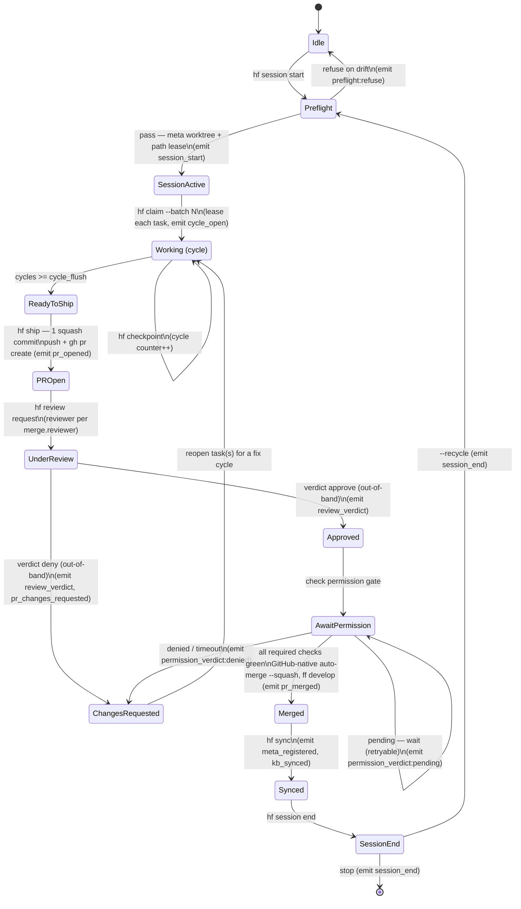

# ADR-0001 — Handoff Loop v2: worktree-isolated, cycle-batched, review-gated shipping

- **Status:** Accepted (refined after review 2026-06-09)
- **Date:** 2026-06-09
- **Deciders:** drdave (+ Claude)
- **Scope:** `hf` CLI, `.handoff/` contract, weave integration
- **Supersedes:** none

## Context

Today the loop is **single-checkout, single-task**: a session claims one task
(now mesh-coordinated via a weave lease — see HFTASK-0002), edits the shared
working tree in place, and commits when told. Shipping is ad-hoc and the
hand-off mechanism is prose in `HANDOFF.md`.

The sibling autonomous loops already running against this machine
(`idd-merge`, `n8n`, `weave-mcp-daemon-tools`) have **independently converged**
on a richer pattern, visible in their relay broadcasts and in
`weave-mcp-daemon-tools/CLAUDE.md`:

- a **fresh git worktree per session**, branched off a freshly-fetched
  long-lived base branch (`develop`), never a stale local ref;
- a **cycle budget** (3–5 tasks) completed before a session hands off;
- **PRs into a protected trunk** (`master`), with `develop` kept
  fast-forwarded to it;
- a **separate review + permission gate** before merge.

We want the Continuity Ledger Kernel to **own this lifecycle as first-class
`hf` verbs**, recorded as witnessed ledger events, so every loop inherits it
instead of re-implementing it in per-repo prose. This ADR captures the design
requested in the 2026-06-09 quick-note (the seven loop-upgrade items).

## Decision

Add a **session lifecycle** (worktrees) and a **shipping lifecycle** (cycle →
ship → review → merge → sync) to `hf`, configured by `.handoff/policy.toml`,
recorded in the ledger, and coordinated through weave (path-scope leases +
review/permission queues).

### 0a. Lifecycle state machine

The full flow as one state machine. Each transition names the **verb** that
drives it and the **witnessed event** it emits (§7). Refusals and the
retryable (non-walling) waits are explicit.



Key properties the machine encodes: the preflight can only **refuse** (never
corrupt), a denied review **loops back into a fix cycle** rather than failing,
the permission wait is a **self-loop** (retryable, never a hard wall), and
`--recycle` returns to `Preflight` so the next session re-validates sync before
reusing a tree.

### 1. Configuration — `.handoff/policy.toml`

```toml
[remote]
model        = "clone"            # "clone" | "fork"
origin       = "FlexNetOS/handoff"
base_branch  = "develop"          # worktrees branch off origin/<base_branch>
trunk_branch = "master"           # PR target / protected
develop_mirrors_trunk = true      # ff develop -> trunk after each merge

[loop]
cycle_flush     = 4               # tasks checked out + completed per cycle (3..5)
batch_checkout  = true            # claim 3-5 tasks at once so the loop never stalls
worktree_prefix = "handoff-"      # meta worktree set name prefix

[merge]
require_review  = true            # a review verdict is required before merge
reviewer        = "cloud_ultra"   # Phase 1: "cloud_ultra" (/code-review ultra)
                                  # Phase 2: "swarm_local" (ruvector/ruflo swarm)
auto_merge      = "on_approve"    # "on_approve" | "never" | "manual"
permission_gate = true            # TRANSITIONAL human gate; lifted once §5b AI gatekeeper + broker trusted

[preflight]
require_clean_tree     = true     # refuse session start on uncommitted changes
require_synced_base    = true     # refuse if develop != trunk, or local != origin
refuse_legacy_weave    = true     # refuse repowire/mcp-broker; require lease-capable weave

[sync]
kb_enabled    = true              # mirror ledger -> .kb on session end / pr_merged
kb_slugs      = ["context/overridable/active", "context/overridable/progress"]
meta_register = true              # idempotently ensure repo in ../.meta.yaml + ../.gitignore
```

#### 1.1 Complete key reference

| Section.key | Type | Default | Meaning |
|---|---|---|---|
| `remote.model` | enum | `clone` | `clone` (single `origin`, push+PR in-repo) or `fork` (`origin`=fork, `upstream`=truth) — §3.3 |
| `remote.origin` | string | `FlexNetOS/handoff` | canonical `owner/repo` |
| `remote.base_branch` | string | `develop` | ref worktrees branch from (after fetch) — §2 |
| `remote.trunk_branch` | string | `master` | protected PR target — §3.1 |
| `remote.develop_mirrors_trunk` | bool | `true` | ff `develop`→trunk after each merge so `develop == trunk` |
| `loop.cycle_flush` | int 3..5 | `4` | tasks completed per cycle before `hf ship` — §4 |
| `loop.batch_checkout` | bool | `true` | claim N tasks at once so the loop never stalls |
| `loop.worktree_prefix` | string | `handoff-` | meta worktree set name prefix |
| `merge.require_review` | bool | `true` | a review verdict is required before merge |
| `merge.reviewer` | enum | `cloud_ultra` | `cloud_ultra` (Phase 1) or `swarm_local` (Phase 2) — §5 |
| `merge.auto_merge` | enum | `on_approve` | `on_approve` \| `never` \| `manual` |
| `merge.permission_gate` | bool | `true` | transitional human/permission gate (§5a); lift once §5b AI gatekeeper + broker trusted |
| `preflight.require_clean_tree` | bool | `true` | refuse `session start` on a dirty tree |
| `preflight.require_synced_base` | bool | `true` | refuse if base/trunk/origin out of sync — §2a |
| `preflight.refuse_legacy_weave` | bool | `true` | require the lease-capable weave; refuse repowire/mcp-broker |
| `sync.kb_enabled` | bool | `true` | enable the one-way `.kb` mirror — §6 |
| `sync.kb_slugs` | list | the two `overridable` slugs | generated kb docs hf may overwrite (allow-list) |
| `sync.meta_register` | bool | `true` | idempotently maintain `.meta.yaml`/`.gitignore` entries |

Resolution order: `.handoff/policy.toml` → built-in defaults (above). Unknown
keys are an error (fail-closed), so a typo can't silently disable a gate.

### 2. Session lifecycle (quick-note items 2, 3, 7)

**Worktrees are managed through the meta worktree engine**, not raw
`git worktree`, so handoff's isolation is tracked by the meta workspace (one
authoritative worktree *set*, never ad-hoc trees — see the Lessons section for
why this matters). Two integration surfaces, in order of preference:

1. **Depend on `meta_git_lib` directly** (the Rust crate behind `meta git
   worktree`). Research (see Research §R3) found it already provides the entire
   engine `hf` needs: `worktree::git_ops::{git_worktree_add, git_worktree_remove,
   remove_worktree_repos}`, a locked worktree **registry with TTL/ephemeral
   cleanup** (`worktree::store`, `~/.meta/worktree.json`), **lifecycle hooks**
   `worktree::hooks::{fire_post_create, fire_post_destroy, fire_post_prune}` (the
   natural attach point for hf's PR-create/review steps), `resolve_branch`,
   `git_ahead_behind`/`git_fetch_branch` (fast-forward signal), `snapshot`
   capture/restore (per-repo branch+SHA rollback), and
   `ensure_worktrees_in_gitignore`. **Reuse this wholesale** — do not reimplement.
2. Fall back to shelling out to `meta git worktree create|add|remove|list|status|
   prune` when the library dependency isn't wired yet.

**Naming resolved (Research §R2):** the dotdir is **`.handoff`** (canonical;
`.hf` exists in no repo). `hf` is only the binary name. Worktrees live as a
tracked meta set under `.worktrees/` at the meta root.

- **`hf session start [--task-slug X]`**
  1. `git fetch origin` (the meta worktree create branches off the fresh remote base)
  2. `meta git worktree create <prefix><slug> --repo handoff` off
     `origin/<base_branch>`
  3. reserve a weave lease on the worktree **path scope** (extends the
     per-task claim lease to the whole tree → two sessions never share a tree)
  4. emit `session_start` event (worktree set, branch, base SHA); reset the
     cycle counter.
- **`hf session end [--recycle]`**
  1. require clean/merged; release the path lease
  2. `meta git worktree remove <set>` (+ `meta git worktree prune` for orphans);
     emit `session_end`
  3. with `--recycle`, immediately `session start` a fresh set
     (item 7: "delete after PR merge and new worktree created").
- **Recovery:** `session start` is idempotent — if the set exists and the lease
  is ours, adopt it instead of failing.

#### 2a. Sync / drift preflight (the prior-failure guard)

`session start` runs a **preflight before any worktree is created**; on any
failed check (with the corresponding `[preflight]` key true) it **refuses to
start** rather than seed a session from drifted state — this is the direct
mitigation for the prior weave-loop failure (Lessons §1). Checks, each grounded
in an existing `meta_git_lib` signal (Research §R3):

| Check | How (signal) | Refuse when |
|---|---|---|
| **clean tree** | `git_ops::git_status_summary` | uncommitted/untracked changes present (`require_clean_tree`) |
| **base fetched & current** | `git_ops::git_fetch_branch` then `git_ahead_behind(local, origin/base)` | local base is behind/ahead of `origin/<base>` (`require_synced_base`) |
| **develop == trunk** | `git_ahead_behind(origin/develop, origin/trunk)` | `develop` has diverged from trunk (not a pure ff mirror) |
| **single source of truth** | `git remote -v` + the meta worktree registry | more than one writable remote, or an untracked ad-hoc worktree exists |
| **lease-capable weave** | `weave lease --help` probe (HFTASK-0002 already detects this) | only the legacy repowire/mcp-broker path is available (`refuse_legacy_weave`) |

The preflight emits a `preflight` ledger event recording the verdict and the
observed SHAs/ahead-behind counts, so a refusal is auditable and a fresh agent
can see *why* a session wouldn't start. It shares machinery with the
HFTASK-0005 `hf drift` gate (same git-state comparison), differing only in
*when* it runs (session entry vs. handoff).

### 3. Branch & remote policy (item 6)

A `policy` module makes the branch/remote model explicit and enforceable. Defined
against the **observed org reality** (Research §R8): the org is *not* uniform —
`weave` is the only repo with `master`+`develop` and live branch protection;
every other repo is trunk-on-`main` with no protection; all repos use a single
`origin` remote (clones, no forks).

#### 3.1 Default branch & trunk

The **default branch** is the ref GitHub checks out on clone and uses as the base
for new PRs. For `handoff` (a loop kernel, the repo type that most needs the
gate), the trunk is **`master`** — matching the proven `weave` protected-trunk
model this whole design borrows from. Both names are config, not hard-coded:
`policy.toml [remote] trunk_branch` / `base_branch`. (The org *majority* default
is `main`; if `handoff` is later aligned to `main`, set `trunk_branch = "main"`
— nothing else changes.)

#### 3.2 `main` vs `master` vs `develop` — what each is for

- **`master` (or `main`) = the trunk.** The single protected, releasable line of
  history and the **PR target**. Never pushed to directly; only branch-protected,
  CI-gated PR merges land here. "`main`" and "`master`" are just two names for
  this same role — GitHub's newer default is `main`; `weave` (and thus
  `handoff`) keep `master`. The repo has exactly **one** trunk; it is not both.
- **`develop` = the always-current integration base.** A long-lived branch kept
  **fast-forwarded to the trunk** (`develop == master`, never ahead). Its sole
  job: be the ref that session worktrees branch from (§2), so a stale *local*
  checkout can never seed a session with old code. It is **not** a second trunk
  and accumulates no independent history — every merge to `master` is immediately
  mirrored to `develop` (`git push origin master:develop`).
- Why both: the trunk is what you *protect and release*; `develop` is what you
  *branch from*. Keeping them identical but separate means "latest base to start
  work" and "protected target to merge into" are distinct refs you can fetch and
  reason about independently, without ever branching off an unfetched local ref.

#### 3.3 Remotes — what they are and how they differ

A **remote** is a named URL pointing at a GitHub repository; branches under it
(`origin/master`, `upstream/master`) are read-only local mirrors refreshed by
`git fetch`. Two models:

- **clone model (default, what the org uses):** a single remote **`origin`** =
  `git@github.com:FlexNetOS/<repo>.git` (SSH). You have write access; you push
  feature branches to `origin` and open PRs **within** the same repo into its
  trunk. `policy.toml [remote] model = "clone"`.
- **fork model (deferred, `model = "fork"`):** **two** remotes — **`origin`** =
  *your fork* (`git@github.com:<you>/<repo>.git`, where you push), and
  **`upstream`** = the canonical repo (read-only to you). PRs are **cross-repo**
  from `origin/<branch>` into `upstream/<trunk>`. Used when you lack write access
  to the canonical repo. Adds cross-repo PR edge cases, hence deferred.

The difference that matters: in the clone model `origin` *is* the source of
truth and you push to it; in the fork model `origin` is your private copy and
`upstream` is the truth you can only reach via PR.

#### 3.4 Enforced invariants

- always fetch, then branch off `origin/<base_branch>` — **never** a local ref;
- never push to the trunk directly; PRs target the trunk and must pass its
  required checks (§9);
- after a merge, **fast-forward `develop` to the trunk** so it stays `== trunk`;
- `model = "fork"` switches pushes to the fork `origin` and PRs to `upstream`.

#### 3.5 Branch vs remote vs worktree — three distinct things (no confusion)

These three are **orthogonal** and were exactly what got conflated in the prior
weave drift ("work scattered everywhere"). A session is *a worktree (directory),
on a branch (history pointer), based on a remote (the source of truth)* — three
independent axes, not one.

| Concept | What it physically is | Cardinality | In this design |
|---|---|---|---|
| **remote** | A named URL to another copy of the repo (`origin`, `upstream`). Its branches appear locally read-only as `origin/<branch>`, refreshed by `git fetch`. | 1 (clone) or 2 (fork) per repo | The source of truth you fetch the base from and push/PR to (§3.3). |
| **branch** | A movable named pointer to a commit — a line of history. A *local* branch you commit to; a *remote-tracking* branch (`origin/master`) mirrors the remote. | Many per repo; **one checked out per worktree** | Trunk (`master`) + base (`develop`) + per-session feature branch (§3.2). |
| **worktree** | A checked-out working **directory** linked to one clone's `.git`. Each worktree has exactly **one** branch checked out; multiple worktrees let several branches be checked out at once from a single clone. | Many per clone, each on a different branch | The per-session isolated directory (§2), a tracked `meta git worktree` set. |

How they compose, concretely, at `hf session start`:
`git fetch` **remote** `origin` → create a **worktree** (new directory) whose
**branch** is a fresh feature branch started from `origin/develop`. Merging moves
the *trunk branch* pointer (via PR), then the worktree is removed — the **remote**
and **branch** persist; only the **worktree directory** is disposable. Confusing
any two of these is what produces "scattered work": e.g. branching off a *local*
branch instead of the *remote* base, or reusing one *worktree* across multiple
*branches* without syncing — both of which §2a's preflight refuses.

### 4. Cycle-batched shipping (item 4) — batch checkout, squash-the-cycle commit

**Cycle model (decided):** a session **checks out 3–5 tasks at once** (a batch
claim — each task still gets its own weave lease) so the loop never stalls
between single tasks, works them all to checkpoint, then produces **one squashed
commit for the whole cycle** and ships a single PR.

- The per-session **cycle counter** is ledger-derived: count `checkpoint`
  events since the last `session_start`.
- `hf status` surfaces `cycles: n/flush`; when `n >= cycle_flush` (default 4),
  `next_command` becomes `hf ship`.
- **`hf claim --batch N`** (up to `cycle_flush` tasks) reserves a lease per task
  and opens the cycle. This is gated by `loop.batch_checkout`: when `true`
  (default) a session claims N tasks at once; when `false` it claims one task at
  a time under a supervisor/orchestrator (the older single-task model) — either
  way the cycle still ships at `cycle_flush`.
- **`hf ship`**
  1. `git add -A && git commit` — **one commit** whose message lists every
     `HFTASK-id` completed in the cycle;
  2. `git push origin <branch>`;
  3. `gh pr create --base <trunk>` → emit `pr_opened` with the PR number.
  - This is an **outward action**; it is gated by the permission system (§5).
    On a "not yet" permission verdict it records the PR intent and **waits
    (retryable)** — it must not hard-wall the loop.
  - Merge squashes again, so per-task commits would be lost anyway — one commit
    per cycle keeps trunk history clean and matches the cycle boundary.

### 5. Review + merge automation with a *separate* agent (item 5) — phased

The reviewer is **always a separate role** from the implementer. How that role
is filled is **phased**, set by `merge.reviewer`:

- **Phase 1 — `cloud_ultra` (now):** `hf review request <pr#>` kicks off
  `/code-review ultra` (the multi-agent cloud review) on the PR branch; its
  verdict drives merge. Chosen because it works as-is with no new build.
- **Phase 2 — `swarm_local` (after ruvector/ruflo integration):** replace the
  cloud reviewer with a **local agent-swarm reviewer** built on ruvector/ruflo's
  rvAgent A2A transport. Note (Research §R5): the per-reviewer verdict *types*
  exist but the **N-reviewers→one-verdict reducer must be built** (~50–100 LOC) —
  this is not a drop-in. Phase 2 is the §5b **AI gatekeeper** (this swarm reviewer
  *upgraded with mandatory full-codebase grounding*).

**Vision:** the permission gate is **transitional**. The end state is a
*fully-automated loop with no human in the loop* — the **§5b AI gatekeeper's
verdict** (as a required status check) *is* the gate. Phase 1's human permission
ask is the safety net while that verdict is being trusted, designed to be lifted
(`permission_gate = false`) once §5b + the envctl broker (R10) are proven.

- **`hf review request <pr#>`** → enqueue into weave's review queue (WL-020, the
  human-facing PR list), open a **permission ask** (WL-021), and dispatch the
  reviewer per `merge.reviewer`. The reviewer's `approve`/`deny(reason)` verdict
  is carried in the **permission answer body** and recorded as a `review_verdict`
  event in **hf's own ledger** (authoritative) — **not** in `weave review`, which
  has no verdict field (Research §R6). hf enforces the gate; weave only records.
- **Merge mechanism = GitHub-native auto-merge (Research §R11, rusty-idd-proven).**
  `hf ship` enables `gh pr merge --auto --squash` on the PR; **GitHub** performs the
  merge when *all required status checks* are green, async, even after the agent
  process exits. `hf` does **not** poll-and-merge or override a red check. The
  review/permission verdict (above) is surfaced to GitHub as a **required status
  check** (a CI check-run), so it composes with branch protection rather than the
  agent calling merge out-of-band. `merge.auto_merge` selects the policy:
  - `on_approve` (default): enable auto-merge as soon as the verdict check is set;
  - `manual`: prepare the PR but require an explicit `hf merge --confirm` to enable
    auto-merge (the loop readies it; a human/gatekeeper triggers);
  - `never`: `hf` only opens/maintains the PR; an external admin merges.
  On `denied`/timeout → emit `pr_changes_requested`, re-open the task(s) for a fix
  cycle; on a red required check → leave the PR open (a wall), never force-merge.
- Merge is the **one gate that blocks** — Phase 1 a human/permission verdict
  (consistent with the `gh repo create` wall in HFTASK-0001 NEEDS-HUMAN),
  Phase 2 the **§5b AI-gatekeeper** verdict (as a required check).

#### 5a. Guardrails adopted from gh-aw (Research §R4)

GitHub's own agentic-workflow system (`gh-aw`) independently arrived at this
exact worker/reviewer/merge split and hardened it. We adopt its model:

- **Separation of privilege (the #1 rule).** The implementer/worker agent runs
  **read-only** — it never holds a write or merge token. It emits the change as
  a **structured intent** (branch + diff + task ids); a **separate, trusted,
  narrowly-scoped job** performs the actual `gh pr create`/push. The reviewer
  likewise emits an **approve/deny decision as data**, and a separate gate job
  acts on it. Agents never hold the merge token — even in the Phase-2 swarm.
- **The reviewer verdict stays OUT-OF-BAND** — recorded in the weave
  review/permission state, **not** as a native GitHub `APPROVE`. A bot APPROVE
  silently counts toward branch-protection required-reviews and would *defeat*
  the gate (gh-aw issue #25439). Native reviews default to `COMMENT`.
- **Merge is a non-agent, Environment-gated job** with its own scoped token.
  This makes the human→swarm transition a change to *who approves the
  Environment*, not a change to any agent's capabilities.
- **A detection/validation step runs between agent output and any write** —
  scan the diff for secrets, protected-file edits, and policy violations before
  the PR is created or merged.
- **Created PRs are draft-by-default**, with a **protected-files denylist**
  (CI config under `.github/`, the loop's own `.handoff/policy.toml` + ADRs,
  credential/manifest files) so a confused or compromised agent — especially
  once the human gate is lifted — cannot rewrite its own guardrails.
- **Least-privilege, per-action tokens**; no broad `write-all`. Network egress
  allowlisting for any agent that touches the internet. Explicit `noop`/
  `missing-tool` reporting so a stuck stage fails loudly, never silently.

#### 5b. The end-state: a surgical AI gatekeeper with full code knowledge

**Every human-in-the-loop approval is ultimately replaced by a surgical AI
gatekeeper** — not a human, and not a blind swarm vote. The gatekeeper's defining
requirement is **full code knowledge**: it must have complete, queryable
knowledge of the codebase, not just the PR diff. Two layers compose:

- **Judgment layer — the AI gatekeeper.** A code-omniscient reviewer backed by a
  **code-intelligence index** of the whole repo (e.g. `git kb code index` /
  `kb_callers`/`kb_impact`, and/or RuVector code understanding), so it reasons
  about a change against its full blast radius (callers, callees, invariants),
  not a context-window snippet. This is what makes it *surgical* — it can approve
  a narrow change and reject a subtly-breaking one because it knows the whole
  graph. It is the `swarm_local` reviewer (§5 Phase 2) **upgraded with mandatory
  full-codebase grounding**.
- **Enforcement layer — a deterministic policy/secret gate.** The gatekeeper's
  *verdict* is judgment; the *action* (mint a token, merge) is gated by envctl's
  `broker::decide` (§9.5 / R10) — a pure, default-deny, fail-closed policy engine.
  The AI decides; the deterministic broker is the only thing that can release the
  credential or trigger the merge. Compromising the AI still can't bypass the
  broker.

Trajectory: `permission_gate` is transitional **toward the AI gatekeeper, not
toward a human** — the human approver is scaffolding removed once the gatekeeper
(with full code knowledge) + the envctl broker are trusted. "No human in the
loop" is the target; the gatekeeper is how the loop closes safely.

### 6. `.kb` + meta sync (item 1)

- **`hf sync`**
  - **meta:** ensure this repo is registered in the parent `../.meta.yaml`
    projects and listed in `../.gitignore` (the meta-repo rule for new crates).
    Idempotent; emits `meta_registered`.
  - **.kb:** push the two generated context docs (`active`, `progress` — the
    `sync.kb_slugs` allow-list) into FlexNetOS `.kb` via `git kb`, so the
    knowledge base mirrors the ledger's active state. **One-way (ledger → kb)**
    to keep Git authoritative. Emits `kb_synced`.
  - Runs at `session end` / after `pr_merged`.

### 7. New witnessed ledger event schema

All new events ride the **existing** generic ledger API
`Ledger::append(event_type, work_order_id, payload_json, ts_ns)` — so each is
automatically SHA3-hashed and chained into the `rvf-crypto` WitnessChain exactly
like today's `task_transition` / `checkpoint` events (no schema migration; the
`events` table already stores arbitrary `event_type` + JSON `payload`). For
loop events the `work_order_id` column carries the relevant correlation id
(session id, PR ref, or task id).

| `event_type` | `work_order_id` | payload fields |
|---|---|---|
| `session_start` | session id | `worktree_set, branch, base_sha, base_branch, trunk_branch` |
| `session_end` | session id | `worktree_set, reason ∈ {merged,aborted}, recycled: bool` (recycle vs stop = `recycled` true/false; `reason` = why it ended) |
| `preflight` | session id | `verdict ∈ {pass,refuse}, checks{clean,synced_base,develop_eq_trunk,single_origin,weave_ok}, ahead_behind` |
| `cycle_open` | session id | `task_ids[], cycle_flush` |
| `pr_opened` | `pr:<owner>/<repo>#<n>` | `branch, trunk, task_ids[], draft: bool` |
| `review_verdict` | `pr:…#n` | `reviewer ∈ {cloud_ultra,swarm_local}, verdict ∈ {approve,deny}, reason, out_of_band: true` |
| `permission_verdict` | `pr:…#n` | `ask_id, status ∈ {pending,approved,denied,timeout}` |
| `pr_merged` | `pr:…#n` | `merge_sha, squashed: true, develop_ffd: bool` |
| `pr_changes_requested` | `pr:…#n` | `reason, reopened_task_ids[]` |
| `meta_registered` | repo name | `meta_yaml: bool, gitignore: bool` |
| `kb_synced` | repo name | `slugs[], one_way: true` (the `.kb` mirror side of `hf sync`) |

(`checkpoint` is a pre-existing event, not re-listed here.) `hf status`/`hf handoff`
derive loop state by replaying these (e.g. cycle count
= `checkpoint`s since the last `session_start`; an open PR = `pr_opened` with no
later `pr_merged`/`pr_changes_requested`). Because the chain is witnessed, the
loop's whole shipping history is tamper-evident and replayable.

### 8. Weave integration summary

- **Leases:** per-worktree path-scope leases (generalizes the HFTASK-0002 claim
  lease).
- **Review/permission:** `weave review` + `weave permission` drive §5.
- **Broadcasts:** on `session_start` / `pr_opened` / `pr_merged`, so sibling
  loops observe activity (the relay traffic already on the mesh).

### 9. CI/CD — GitHub Actions, automations, rules, env vars & secrets

The merge gate (§5) is only as real as the branch protection behind it. This
section defines the CI/CD surface `handoff` adopts, grounded in the org's actual
setup (Research §R8). **Today `handoff` has none of this** (not yet pushed, no
`.github/`) — this is the target state.

#### 9.1 Actions (the workflows)

`handoff` ships the canonical FlexNetOS Rust-crate workflow set under
`.github/workflows/`:

- **`ci.yml`** — `on: { push: [trunk], pull_request: [trunk], repository_dispatch:
  [dependency-updated] }`. Jobs that become the **required checks**: `test`
  (matrix), `clippy` (`-D warnings`), `format` (`cargo fmt --check`), `build`.
  `env: CARGO_TERM_COLOR: always`, `RUSTFLAGS: "-D warnings"`.
- **`auto-format.yml`** — runs `cargo fmt --all`, commits any fix back as
  `github-actions[bot]`, with a loop-guard (`github.actor != 'github-actions[bot]'`).
  `permissions: contents: write`.
- **`notify-parent.yml` / `notify-downstream.yml`** — cross-repo signaling (§9.2).

#### 9.2 Automations (cross-repo signaling mesh)

The org coordinates repos with a bidirectional `repository_dispatch` mesh
(`peter-evans/repository-dispatch`, SHA-pinned), each gated by
`lewagon/wait-on-check-action` so a repo **only signals after its own CI is
green**. Event vocabulary: `child-repo-updated` (child→parent, opens an
auto-merge squash sync PR), `dependency-updated` (parent→downstream, re-runs
dependents' CI), `release-tagged` (release fan-out). `handoff` joins as a leaf:
emit `child-repo-updated` to `FlexNetOS/meta` after CI green. **Caveat from R8:**
the receiving auto-merge only means anything if the receiver has branch
protection — so adopt the mesh *and* §9.3 together, never the mesh alone.

#### 9.3 Rules (branch protection / required checks)

`handoff`'s trunk gets **real** branch protection (today only `weave` has any):

- **Required status checks:** `test`, `clippy`, `format`, `build` — all must be
  green to merge. These four are **handoff's own** set and are exactly what `ci.yml`
  defines (no documents-N-enforces-M gap — the R8 drift to avoid). handoff is a
  single-backend crate, so it deliberately omits weave's extra `build (libsql
  backend)` / `sign` / `libsql + sign` contexts; `format` here is `cargo fmt
  --check` (weave names the same job `rustfmt`). If features are later added, the
  required set is updated *in lockstep* with the job names — protection contexts
  must always equal the `ci.yml` job set.
- **Strict / up-to-date:** `strict = true` (branch must be current with trunk
  before merge — pairs with the §3 `develop==trunk` ff rule).
- **`enforce_admins`:** a *deliberate* choice — `weave` leaves admins able to
  bypass for emergencies; `handoff` does the same, documented, not accidental.
- **Required reviews:** the §5 reviewer is the review gate; whether to *also* set
  GitHub's native required-reviews is intentionally **off** to avoid the bot-
  APPROVE bypass (§5a / R4 #25439) — the verdict stays out-of-band.

#### 9.4 Environment variables & token permissions

- **Workflow `env:`** stays minimal: `CARGO_TERM_COLOR`, `RUSTFLAGS: -D warnings`.
- **`GITHUB_TOKEN` least-privilege:** top-level `permissions: contents: read` by
  default; escalate **per-job** only where needed (`contents: write` for
  auto-format, `pull-requests: write` for sync-PR jobs, `permissions: {}` for
  pure-dispatch jobs). No `write-all`. This mirrors the §5a/gh-aw separation:
  the agent/worker stages never get a write token.
- **Actions `vars`** (non-secret config): none today; if needed, prefer repo/org
  `vars` over hard-coding.

#### 9.5 Secrets

- **Scope:** the org keeps cross-cutting credentials as **org-level Actions
  secrets** (every repo shows 0 repo-level secrets). `handoff` inherits the org
  secrets it needs rather than duplicating them.
- **Secrets in play (R8):** `PARENT_REPO_PAT` (cross-repo dispatch + bot push),
  `CARGO_REGISTRY_TOKEN` / `NPM_TOKEN` (publish), `REPO_WRITE_PACKAGES_PAT`,
  `HOMEBREW_TAP_TOKEN`, `DISCORD_RELEASES_WEBHOOK_URL`, and the built-in
  `GITHUB_TOKEN`.
- **Hardening this design adds (the biggest gaps R8 found):**
  1. **GitHub Environments** — the org currently has **zero**. `handoff` defines
     a `merge-gate` (and later `release`) **Environment** with required
     reviewers + environment-scoped secrets. This is the infra that makes the §5
     "permission-gated merge" real and makes the human→swarm transition a change
     of *who approves the Environment*, not a code change (R4).
  2. **Integrate the envctl `secrets-engine` (R10) as the secret relay/injection
     layer — the preferred path over raw org PATs.** Instead of handing the loop a
     long-lived `PARENT_REPO_PAT`, the worker receives only a short-lived,
     peer-bound, revocable **relay bearer** (`relay_mint`, ≤24h); the real GitHub
     credential stays in the encrypted vault and is swapped in only at egress
     (`relay_swap`) by the broker. The **`broker::decide` policy gate** (pure,
     default-deny, host/path/method allowlists + budgets + fail-closed presence
     gate) **is** the deterministic enforcement layer under the §5b AI gatekeeper:
     the gatekeeper judges, the broker is the only thing that releases the token
     or permits the `POST /repos/{o}/{r}/merges` call. This replaces both the
     `PARENT_REPO_PAT`-split and the "GitHub App / OIDC" placeholder. **Greenfield
     (R10):** the GitHub `ProviderMint` (native scoped sub-token) and the
     `inject.rs`/`run_child` child-env path are stubs — for a genuinely scoped
     token they must be implemented; the relay-bearer + `relay_swap` HTTP path
     works today. `flexnetos_github_app` is the home for the GitHub `ProviderMint`.
  3. **SHA-pin all third-party actions** (the release path already does).
  4. **Until envctl is wired,** as an interim split the overloaded
     `PARENT_REPO_PAT` into purpose-scoped fine-grained PATs (dispatch vs publish).

#### 9.6 FlexNetOS meta conventions handoff adopts (R12)

handoff is a meta member, so it inherits the org convention set (verified in
`~/Desktop/meta`, R12). §9.1–9.5 above (built from the weave model) are the
loop-specific subset; this is the **rest of the org baseline** handoff currently
lacks, and must adopt to avoid the drift the reports found in rusty-idd:

- **Conventional Commits + semantic PR titles:** `commitlint.config.cjs` (12
  types) + merge-blocking `semantic-pr-title.yml`. Feeds release-please changelogs.
- **Release automation:** `release-please` (manifest mode, `release-type: rust`) +
  a **`VERSION`** source-of-truth file + 5-platform `release.yml`. *Not* cargo-dist.
- **Dependency updates: Renovate** (`renovate.json`, `config:recommended`). **Not
  Dependabot** (D3).
- **Local hooks: `.githooks/`** (`commit-msg`=commitlint, `pre-commit`=`cargo fmt
  --check`, `pre-push`=fmt+clippy+test) wired by `make install-hooks`. **Not**
  Python `.pre-commit` (D4).
- **Task runner: `Makefile`** (`build`/`test`/`lint`/`install-hooks`). Not Justfile (D7).
- **Agent governance:** `.claude/agent-guard.toml` (destructive-command patterns),
  `.claude/settings.json` session hooks, `.claude/rules/` — handoff has none today.
- **CI baseline:** 3-OS matrix (C6), `Swatinem/rust-cache` (C10), pinned toolchain
  (`rust-toolchain.toml` / workflow pin `1.96.0` — defensible per R12/A2),
  `CONTRIBUTING.md`.
- **Already done:** handoff is registered in `.meta.yaml` (the one thing rusty-idd
  was missing — D5).

These are mechanical alignment, tracked as **HFTASK-0016** (separate from the
loop-logic tasks).

### 10. Hook & policy layer — lifecycle automation (brought forward, R9)

The original package shipped a **hook contract** and **policy rules** that the
Rust spike had dropped; they are restored (upgraded) and are the answer to "what
actually drives the loop with no human in it":

- **`.handoff/hooks/hooks.toml` (`handoff.hooks.v1`)** — the agent harness fires
  `hf` on lifecycle events, `fail_mode = block` being a hard gate:
  `SessionStart → hf resume`; `PreSessionStart → hf session preflight` (§2a, block);
  `TaskClaim → hf policy check-claim` (block); `PreEdit → hf policy check-edit`
  (block); `PostEdit → hf checkpoint --auto`; `PreHandoff → hf drift && hf policy
  check-handoff` (block); `SessionStop → hf checkpoint && hf handoff`;
  `PostMerge → hf sync`. This is the lifecycle-automation substrate — the loop
  isn't a script, it's these hooks reacting to events.
- **`.handoff/policies/rules.toml` (`handoff.policy.rules.v1`)** — fail-closed
  defaults (`deny_without_claim`, `deny_unless_task_allows`), lease timings
  (heartbeat 30s, stale 300s, force-release 1800s — to reconcile with the
  HFTASK-0002 claim TTL), handoff requirements, drift blocks, a **protected-files
  denylist** (§5a), and a blocked-command list.
- **`hf policy`** is the implied verb surface (`check-claim`/`check-edit`/
  `check-handoff`) that reads these rules — tracked as HFTASK-0015.

### 11. Front Door / Intake (prompt_hub → handoff.task.v1)

The loop's *input endpoint*. Today this is one backlog row (HFTASK-0003) and a
passing "vision" note — underspecified (Research §R14). Detailed here:

- **The front door = `meta/RuVector/ui` (RuVocal) + prompt_hub.** RuVocal is the
  *human* chat surface (the real, chosen UI — not the failed envctl/loop-forge
  zellij dashboard, §12); **prompt_hub** is the *intent engine* behind it (mature:
  `vibe <request>`, `get <role> <intent>`, `generate_swarm_bundle()`, an axum
  `/vibe` + `/generate_bundle` HTTP API, and a `prompthub` CLI). The front-door
  work is **wiring RuVocal → prompt_hub → handoff intake** (HFTASK-0022 + this).
- **Transport decision (R14):** there is **no MCP server on either side** —
  prompt_hub has none and `hf` has none. So HFTASK-0003's "over the MCP seam" is
  *unbuilt*. Choose one, explicitly: (i) call prompt_hub's existing HTTP
  `/vibe`+`/generate_bundle`; (ii) depend on the `prompt-hub` crate directly;
  or (iii) build the MCP seam (HFTASK-0019) and dispatch over it. The
  spike's mirrored-type shortcut is disowned by HFTASK-0003.
- **The crux — type-impedance synthesis.** A `SwarmBundle` is a bundle of *role
  prompt strings* (and `role_prompts` is an empty-in-production stub, R14), **not**
  work specs. The intake must synthesize a vibe `Intent` into **real
  `handoff.task.v1` fields** — `path_scope`, `acceptance_criteria`,
  `test_commands` — or every dispatched WorkOrder is **unverifiable** by the §5
  review gate and §5b gatekeeper. This synthesis is the real work, not the
  envelope conversion.
- **Promote the spike:** `work_order::work_orders_from_bundle` exists but uses a
  *mirrored* SwarmBundle and is **test-only** (never called by the `hf` binary,
  R14). Replace the mirror with a dependency on prompt_hub's real `SwarmBundle`
  and wire it into a real verb (`hf intake`/`hf dispatch`). → HFTASK-0003 (now
  spec'd, not a one-liner).

### 12. Mission Control (loop observability + control)

The *observe/control surface* — absent from the ADR until now (the gap the user
flagged). **Naming collision (R14):** "mission control" already labels envctl's
**zellij-layout generator** (`envctl dashboard`, mirrored by `meta_dashboard_cli`,
with a native `envctl-gui` egui app) — but those render *workspace* build/drift
ops, **not** the handoff loop's state. Disambiguate: **workspace mission control
(zellij/envctl)** vs **loop mission control (ledger observability)** — this is the
latter.

- **Data source already exists:** the witnessed ledger event stream (§7) is the
  perfect backing read-model — `session_start/cycle_open/pr_opened/review_verdict/
  permission_verdict/pr_merged/pr_changes_requested`. Loop state is already
  replay-derived (§7). Expose it as a machine feed: **`hf status --json`** + an
  **`hf watch`** (tail the ledger + weave broadcasts; optional SSE endpoint).
- **Control verbs already exist** — mission control just surfaces them: `hf
  resume`, `hf review request`, the `weave permission` answer, `hf merge
  --confirm` (the `auto_merge=manual` path, §5), and abort.
- **Render layer — the human surface is `meta/RuVector/ui` (RuVocal), not a new
  build.** Background (user): envctl already *attempted* a zellij multi-pane
  dashboard (via the loop-forge / Feature-Forge loop) **and it failed** — so the
  `envctl dashboard` / `envctl-gui` zellij path is a **dead end, not a precedent
  to reuse**. The real, chosen front-door + observe surface is **RuVocal** (the
  `RuVector/ui` chat app), which needs **prompt_hub integration** (and loop-event
  surfacing). Plan: keep the machine feed (`hf status --json` / `hf watch` over
  the ledger + broadcasts) as the data layer → HFTASK-0020; the human surface is
  **RuVocal adopt-and-extend** (prompt_hub intake + loop-state + delivery), now a
  first-class front-door task → HFTASK-0022 (not a longer-horizon afterthought). A
  throwaway local TUI is fine only as a stopgap while RuVocal is wired.

### 13. Delivery / Output endpoint

The pipeline is **prompt_hub (input) → process → delivery (output)** (R12/R14);
the ADR covers input (§11) and process (§2–§10) but had **no output endpoint**.
A completed, merged cycle must report its result back to the originating front
door. The hook already exists: the **`correlation_id` (= prompt_hub
`workflow_id`)** is carried on every WorkOrder, so a merged PR's outcome can be
round-tripped to the originating vibe request — surfaced in RuVocal chat or via
`prompt_hub summarize <run-id>` / its `feedback` verb. Emits on `pr_merged`.
→ HFTASK-0021.

## Lessons baked in (from the prior weave loop failure)

The earlier weave-driven loop **did not work reliably**, with evidence pointing
to two root causes. This design is shaped to avoid both:

1. **Multiple trees / branches / remotes drifted out of sync.** A loop spread
   across ad-hoc worktrees, branches, and remotes lost a single source of
   truth. → Mitigations: one authoritative base (`origin/<develop>` *after a
   fetch*, never a local ref); `develop` kept `==` trunk; **all** worktrees are
   tracked *sets* via `meta git worktree` (§2), never hand-rolled `git worktree`;
   a `hf session start` **preflight** that verifies tree/branch/remote sync
   before any work and refuses to start on drift (ties into the HFTASK-0005
   drift gate).
2. **It used the old `repowire` + `mcp-broker` hooks.** Those are deprecated and
   were implicated in the breakage. → This design depends **only on the current
   lease-capable `weave`** (the build that exposes `weave lease` and the
   review/permission queues). `hf` must detect and refuse the legacy
   repowire/mcp-broker path rather than silently coordinate through it.

These are correctness requirements, not nice-to-haves: HFTASK-0007/0008 must
land the sync preflight, and HFTASK-0010 must target current-weave queues only.

## Consequences

**Positive**
- Every loop gets worktree isolation, cycle batching, and a review/merge gate
  for free; `HANDOFF.md` prose becomes a *compiled view*, not the mechanism.
- Concurrent sessions stop colliding on a shared tree.
- The whole lifecycle is a witnessed event stream — replayable and auditable.

**Negative / risks**
- Requires the **lease-capable weave** as the default install (today the
  installed `~/.cargo/bin/weave` is older; `hf` degrades but isn't coordinated).
- Depends on `gh` + branch protection existing; fork model adds cross-repo PR
  edge cases (deferred).
- The **PR-write side is greenfield** (Research R3): PR create/merge, the
  review-gate policy, develop→master/ff, and fork support have no existing impl;
  `flexnetos_github_app` is an empty placeholder. Worktree mechanics are *not*
  greenfield — reuse `meta_git_lib`.
- More verbs and config surface to maintain and test.

## Research & Cross-References (evidence base)

> Per process rule: every ADR must be backed by deep web + codebase research,
> cross-referenced. This section records the evidence behind the decisions above.
>
> **Verification status (process rule: manually verify agent findings before
> major decisions).** The load-bearing claims were re-checked by hand, not
> trusted from the research agents alone:
> - **R2** ✅ direct scan — `.handoff` exists only in `handoff/`; `.hf` in no repo.
> - **R3** ✅ grepped `meta_git_lib/src` — `git_worktree_add/remove`,
>   `git_ahead_behind`, `resolve_branch`, `resolve_from_pr`,
>   `ensure_worktrees_in_gitignore`, `fire_post_create` all present.
> - **R6** ✅ read `weave-core/src/model.rs` — `ReviewItem` has **no** verdict
>   field; `PermissionStatus = Pending|Approved|Denied|Timeout` confirmed.
> - **R8** ✅ live `gh api` — weave's 6 required checks verbatim; `meta_cli`
>   unprotected; weave & meta_cli `environments.total_count = 0`.
> - **R5** ✅ hand-verified against source (RuVector is production-grade but
>   complex, walked crate-by-crate): `spawn_sync` IS a stub
>   (`rvagent-subagents/src/orchestrator.rs:58-60`), `spawn_parallel` is
>   sequential (no JoinSet, lines 103-110), the A2A process-spawn path works
>   (`examples/a2a-swarm`, ADR-159 acceptance test), the verdict TYPES exist
>   (`ApprovalDecision` hitl.rs, `GateResult` agent_contracts.rs, `GateDecision`
>   replay.rs), and a grep for quorum/consensus/aggregate/vote/tally confirms **no
>   N-verdicts→one-verdict reducer exists** — it is genuinely greenfield. The §5
>   Phase-2 statement is accurate.

### R1 — Prior-session design lineage (codebase)

This ADR continues a same-day research line; the upstream artifacts (all under
`~/Desktop/meta/`):

- `RUVECTOR-RUNBOOK.md` — RuVector crate-map runbook (314 crates walked with an
  agentic-role lens). Establishes that `rvAgent` (`rvagent-core/subagents/a2a`)
  is the **agent-swarm substrate** for the Phase-2 `swarm_local` reviewer (§5).
- `RUVECTOR-META-MAPPING-S1.md` — maps the 12-crate Ark Handoff Ledger onto
  existing RuVector/meta capabilities; ~8/12 needs already have production
  equivalents → "adopt what's built." Source of the `handoff.task.v1` envelope
  and the Git > ledger > task-cards precedence.
- `STACK-INTEGRATION-PLANS.md` — three integration plans (contract-/store-/
  door-first); the real blocker is *connectors*, not more tools.
- `SESSION-HANDOFF.md` — locks the "Continuity Ledger Kernel" / `.handoff`
  naming and seeds HFTASK-0001..0006.

### R2 — Naming + dotdir audit (codebase, 65 repos under `~/Desktop/meta`)

- **`.handoff` is canonical**; `.hf` exists in **no** repo. Resolves the open
  question: binary = `hf`, dotdir = `.handoff`.
- Worktrees are an established meta concept: `.worktrees/` at the meta root
  holds ~38 tracked branch sets; `.meta` / `.meta-snapshots` / `.looprc` are
  meta-CLI/loop owned — confirming §2's "tracked set, not ad-hoc tree."
- Drift flagged (not handoff's to fix, logged for the workspace): `.agent`
  (singular) vs `.agents`; `.codex-plugin` coexisting with `.codex` in ECC;
  `grit/.rtk` vs expected `.roo`.

### R3 — Reuse map (codebase: meta_git_lib / meta_git_cli / loop_lib)

Walk of the named projects (note: `meta_git` and `meta_projects_cli` do **not**
exist — actual crates are `meta_git_cli/lib`, `meta_project_cli`):

| hf need | Reuse from | Symbol |
|---|---|---|
| worktree add/remove/prune | `meta_git_lib` | `worktree::git_ops::*`, `meta_git_cli/commands/worktree/create.rs:handle_create` |
| worktree registry + TTL/ephemeral | `meta_git_lib` | `worktree::store` (`~/.meta/worktree.json`, locked) |
| lifecycle hooks (attach PR steps) | `meta_git_lib` | `worktree::hooks::{fire_post_create,fire_post_destroy,fire_post_prune}` |
| branch resolution / fetch / ahead-behind | `meta_git_lib` | `worktree::helpers::resolve_branch`, `git_ops::{git_fetch_branch,git_ahead_behind}` |
| snapshot checkpoint/rollback | `meta_git_lib` | `snapshot::{capture_repo_state,restore_repo_state}` |
| gitignore worktrees | `meta_git_lib` | `worktree::helpers::ensure_worktrees_in_gitignore` |
| start work from a PR | `meta_git_lib` | `worktree::helpers::resolve_from_pr` (`gh pr view --json headRefName`) |
| parallel cross-repo fan-out | `loop_lib` | `run`, `run_commands`, `JsonOutput` |

**Greenfield (no existing impl anywhere):** PR *create*, PR *merge* (squash/ff),
the review-gate policy, develop→master + fast-forward enforcement, fork-vs-clone.
`flexnetos_github_app` is an **empty placeholder repo** (remote configured, zero
commits) — a natural future home for the trusted PR-writer / merge-gate (§5a),
but it must be authored from scratch.

### R4 — External best practice (web: GitHub Agentic Workflows, `gh-aw`)

`github/gh-aw` (GitHub Next) independently validates the worker/reviewer/merge
split and supplies the §5a guardrails. Load-bearing findings:

- **Separation of privilege:** the agent job is read-only and emits structured
  "safe-output" intents; separate scoped-write jobs execute them after a
  threat-detection pass. "Even a fully compromised agent cannot directly modify
  repository state."
- **No merge safe-output exists by design** — gh-aw deliberately keeps PR merge
  a human/branch-protection decision. → our merge stays a non-agent gated job.
- **Bot-approval bypass (issue #25439):** a `github-actions[bot]` `APPROVE`
  counts toward required-reviews; keep the reviewer verdict out-of-band.
- Draft PRs by default; protected-files guard (blocks `.github/`, `CLAUDE.md`,
  manifests); Environments as the human-in-the-loop gate primitive (swap the
  approver to flip human→swarm); network egress allowlist; keep source +
  compiled artifact in sync.
- Sources: github.com/github/gh-aw · githubnext.github.io/gh-aw (overview,
  architecture, safe-outputs, safe-outputs-pull-requests, triggers, tokens) ·
  gh-aw issue #25439.

### R5 — Phase-2 swarm reviewer feasibility (codebase: RuVector/rvAgent, ruflo)

The `swarm_local` reviewer (§5 Phase 2) is **feasible but partly greenfield**:

- **Working & reusable:** A2A transport (signed `AgentCard`, `PeerRegistry`,
  HTTP JSON-RPC, per-node budget + `recursion_guard`) — `examples/a2a-swarm` is
  a passing acceptance test that spawns/discovers/dispatches/tears-down real
  `rvagent a2a serve` processes. Reusable verdict TYPES:
  `rvagent-middleware/hitl.rs::ApprovalDecision{Approve,Deny,ApproveWithModification}`;
  `verified-applications/agent_contracts.rs::GateResult{allowed,reason,receipt}`
  (**provable** via `ruvector-verified` Lean contracts);
  `cognitum-gate-tilezero/replay.rs::GateDecision{Permit,Deny,Defer}` (+ witness
  replay). Reviewer-output hardening: `SubAgentResultValidator` (injection/length
  guards). Role "lenses" exist as persona cards in `.ruv/agents/rvagent-{security,
  tester,coder,queen}.md`.
- **Missing (build it):** the **N-reviewers → one approve/deny reducer** (quorum
  / any-blocker-vetoes / weighted-by-lens) — no such function exists; ~50–100
  LOC over the existing types. Also: `SubAgentOrchestrator::spawn_sync` is a
  STUB (use the process-level `rvagent a2a serve` path instead), lens→model
  wiring, and a diff→reviewer-input adapter.
- Seam options: depend on the Rust crates, or the `rvagent-mcp` MCP server, or
  the `rvagent` CLI (process-per-lens). For provable+witnessed verdicts, pair
  `enforce_contract` with the `.handoff` `rvf-crypto` WitnessChain.

### R6 — Out-of-band verdict mechanism (codebase: weave review/permission) — GAP

§5/§5a assume weave can hold the review verdict + the merge-permission verdict
out-of-band. Verification (weave-mcp-daemon-tools):

- **`weave permission` (WL-021): ✓ sufficient.** `weave_ask_permission` +
  `weave_permission_status` record an out-of-band verdict
  `Pending|Approved|Denied|Timeout` (Approved iff the answer body == "approve",
  case-insensitive; unanswered past `timeout_secs` → Timeout = denied). Stored in
  the `asks`+`messages` tables, **not** a GitHub approval — exactly the
  bypass-avoiding channel §5a wants.
- **`weave review` (WL-020): ✗ no verdict field.** `ReviewItem` tracks only
  `state{Open,Merged,Closed}` + `reviewed_at` + `reviewed_by` — i.e. *reviewed
  vs not*, with **no Approve/RequestChanges/Deny**. It also does not *enforce*
  anything (records, doesn't gate), and permission asks carry no PR/branch ref.
- **Resolution (decided):** do NOT depend on `weave review` for the verdict.
  Carry the reviewer's approve/deny **in the `weave permission` answer body**
  (e.g. `approve` / `deny: <reason>`) and/or record it as a `review_verdict`
  **event in hf's own ledger** (the authoritative store). Use `weave review` only
  as the human-facing PR queue. Optionally file a separate weave task to add a
  `verdict` column to `ReviewItem` later. The merge gate is enforced by **hf**
  reading the permission status + its own `review_verdict` event — weave does not
  gate.

### R7 — `.kb` + meta sync mechanics (codebase: .meta.yaml, .gitignore, git kb)

§6/HFTASK-0011 verified against the live workspace:

- **Part A already done:** `handoff` is **already** registered in
  `~/Desktop/meta/.meta.yaml` (`projects.handoff.repo = git@github.com:FlexNetOS/handoff.git`)
  and ignored in `~/Desktop/meta/.gitignore` (with a **duplicate** `handoff/`
  line to clean). There is **no `meta project add`** (the `project` plugin is
  read-only: list/check/dependents) → registration is a guarded file edit. So
  `hf sync` Part A = **idempotent ensure/repair**, grep-guarded, never blind
  append.
- **Part B — no upsert:** `git kb create` errors on an existing slug. The
  idempotent push is **show-or-create → checkout → full-overwrite body →
  commit**, scoped to the two generated slugs `context/overridable/active` and
  `context/overridable/progress` (both already exist, type `context`). Preserve
  frontmatter `id` (checkout first; never `rm`+recreate — it breaks UUID/version
  lineage). The DB (`.kb/store/`) is the source of truth; `.kb/workspaces/` is
  scratch (already git-ignored).
- **One-way discipline (structural, hf-enforced):** hf only ever *writes* those
  generated slugs, **full-overwrites** from a ledger-derived body, **never reads
  `.kb` back as truth**, tags them `generated`, and never touches
  `context/immutable/*`, `context/extensible/*`, or `tasks/*`. `git kb status`
  before checkout on shared slugs; never `--force` on shared docs. MCP `kb_*`
  tools are an optional nicety — the `git kb` CLI is the portable contract.

### R8 — CI/CD reality across FlexNetOS repos (codebase + `gh api`)

Evidence behind §3 and §9 (verified live; `gh` had `repo,workflow,read:org`,
so repo-level protection/secrets/envs were readable, org-level secrets were not):

- **Default branch / develop:** `weave` = `master` **with** a `develop` branch
  and live branch protection; **every other repo** (`meta`, `meta_cli`,
  `meta_git_lib/cli`, `ECC`, `RuVector`, `ruflo`) = `main`, **no `develop`**, **no
  protection**. `handoff` is `master` locally and **not yet on GitHub** (404, no
  `.github/`). So the develop↔master model is a *weave contract*, not org-wide.
- **Remotes:** every repo uses a single `origin` = `git@github.com:FlexNetOS/<repo>.git`
  (SSH). **No fork model in use** — all clones.
- **Protection (live `gh api`):** only `weave` is protected — required contexts
  `rustfmt, clippy, test, build (libsql backend), sign, libsql + sign`,
  `strict: true`, `enforce_admins: false`, **no required reviews**, no forced
  linear history. Its `CLAUDE.md` documents 4 checks but **6** are enforced. The
  `main` repos' `on-child-update.yml` runs `gh pr merge --auto --squash` into a
  repo with **no protection** → the auto-merge mesh is currently *advisory*.
- **Workflows:** canonical set per crate = `ci.yml` (test matrix / clippy /
  fmt), `auto-format.yml` (fmt + bot commit-back, loop-guarded), `notify-*.yml`.
  Parent `meta` adds `release.yml` (release-please → 5-target build → 9-crate
  crates.io publish → Homebrew → Discord).
- **Automations:** `repository_dispatch` mesh via `peter-evans/repository-dispatch`
  (SHA-pinned), gated by `lewagon/wait-on-check-action`; events
  `child-repo-updated` / `dependency-updated` / `release-tagged`.
- **Env/permissions:** `CARGO_TERM_COLOR`, `RUSTFLAGS: -D warnings`; disciplined
  least-privilege `permissions:` (`{}`, `contents: read`, scoped `write`). No
  repo/org `vars` at repo level.
- **Secrets:** all **org-level** (0 repo-level, **0 Environments anywhere**).
  In play: `PARENT_REPO_PAT` (15 refs), `CARGO_REGISTRY_TOKEN`, `GITHUB_TOKEN`,
  `NPM_TOKEN`, `REPO_WRITE_PACKAGES_PAT`, `HOMEBREW_TAP_TOKEN`, Discord webhook.
  **Biggest gap:** no GitHub Environments → the merge/publish gate the design
  needs does not exist as infra yet.

### R9 — Source reconciliation vs the original package (no-downgrade check)

Process principle (user, critical): **never downgrade, always upgrade and
automate.** `~/Downloads/tmp/handoff/.archive/ark_handoff_ledger_v2_package.zip`
(2026-06-02) is the original "Ark Handoff Ledger v2" package the Rust spike was
built from. Reconciliation of current repo vs the package:

- **Present / not lost:** `schemas/{task,session,packet}.schema.json` ✅ (the
  `handoff.task.v1` envelope = the `work-order` crate); `docs/` PRD ✅ (renamed);
  `backlog.yaml` ✅.
- **Dropped by the spike → now brought forward (upgraded):**
  `.handoff/hooks/hooks.toml` (hook contract — §10), `.handoff/policies/rules.toml`
  (policy rules — §10), `.handoff/skills/session-resume.skill.md` (resume skill).
  These were a real downgrade (the lifecycle-automation + policy layer); restoring
  them is the upgrade. The package's `templates/AGENTS.md` still said "Ark" — the
  repo's `AGENTS.md` is the corrected version.
- **Conclusion:** the current Rust repo is the *upgrade* of the package's
  Rust-less template bundle, now re-completed with the dropped automation layer.

### R10 — envctl `secrets-engine` (the secret relay/injection tool)

Verified deep-dive of `~/Desktop/meta/envctl/crates/secrets-engine` (the "secret
relay/injection tool" to integrate). It is a production-grade **vault + credential
broker + relay** library (`envctl_secrets`), driven by `secretd` (gRPC) +
`secretctl` (CLI):

- **Vault (real, tested):** XChaCha20-Poly1305 AEAD per record, fixed canonical
  AAD binding rows un-relocatable, LUKS-style DEK keyslots (Argon2id passphrase +
  optional USB), DEK in RAM only, hash-chained tamper-evident audit.
- **Broker gate (real, tested) — the key reuse:** `broker::decide` is a **pure,
  sync, default-deny** policy function → `RelayDecision::{Allow, Deny{reason}}`
  over ~25 `DenyReason`s (host/path/method allowlists, peer binding, budgets,
  rate, clock-rollback) with a **fail-closed presence gate** (`GateState`,
  `Unproven → deny`). A clean drop-in **merge-gate** and the enforcement layer
  under the §5b gatekeeper.
- **Relay (real, tested):** `relay_mint` issues a ≤24h, peer-bound, revocable
  `evrelay_…` bearer (only its MAC is persisted); `relay_swap` swaps it for the
  real key **only at egress** — proven by 20+ tests that the real key never
  reaches the worker, events, audit, or a hostile upstream. **Replaces
  `PARENT_REPO_PAT` for `api.github.com` egress today.**
- **Stubs (greenfield):** the GitHub `ProviderMint` (native scoped sub-token —
  the literal fine-grained-PAT replacement) is `NoMint`; `inject.rs` /
  `Engine::run_child` / `secretctl run` (child-env injection into `gh`/`git`) are
  `todo!()` (Phase 6/8); the MITM `ca.rs` is a placeholder (only needed for the
  proxy data-plane mode).
- **Surface:** Rust API (`Engine`), gRPC `secretd` (`Relay.Mint/Revoke`, `Vault`,
  `Lock`, `Audit`), CLI `secretctl` (`relay create/mint/revoke`, `run`).

### R11 — rusty-idd (a proven sibling merge-automation loop) — hand-verified

`FlexNetOS/rusty-idd` ("IDD" = Intent-Driven Development) is a Rust workspace
(~20k LOC, ~463 tests) **plus** an autonomous "idd-merge-loop" harness (skills +
`scripts/ralph-idd.sh`, *prose+bash, not compiled*) that builds it. Cloned
read-only to `/tmp/rusty-idd-research`; the load-bearing claims below were
**verified by hand** (read the actual SKILL.md + workflow YAML), not taken from
the research agent:

- **Merge model (verified `idd-merge-loop/SKILL.md:22,25,65,72,111`):** each run
  pushes a branch, opens **one** PR `--base develop`, and enables **GitHub-native
  auto-merge** (`gh pr merge --auto --squash`). `develop` is branch-protected
  (required check `rust`) → **fail-closed**: GitHub merges only on green CI,
  async, *even after the agent process exits*. A **red** required check is a hard
  wall (`NEEDS-HUMAN: PR #N red`) — never force-merged. **The required CI check is
  the sole merge authority; the agent never calls a blocking merge or overrides
  red.** Opening+auto-merge is *pre-authorized* (not a per-PR human gate).
- **Two-tier (verified):** dev → `develop` (loop has authority); `develop` →
  `main` only via a separate promotion PR gated by `rust` **+** `promote-verify`
  (`promote-verify.yml`: clean-merge-into-main probe + locked build/test + drift +
  fmt/clippy + `cargo audit`). The loop never pushes/admin-merges `main`.
- **CI (verified `ci.yml`):** `rust` job = drift-check → `build --locked` →
  `test --locked` → `fmt --check` → `clippy -D warnings` → `cargo audit --deny
  warnings`; `msrv` job builds on the 1.88 floor. `permissions: contents: read`.
- **Verified bug to avoid if copied:** `promote-verify.yml:37-39` has one step
  with **two `run:` keys** (`.gemini` then `.claude` drift-check) — YAML keeps
  only the second; the first is silently dropped.
- **No `repository_dispatch`, no GitHub Environment** anywhere (grep-confirmed) —
  so handoff's §9 dispatch mesh + merge-gate Environment are net-new (no reuse).
- **Could-not-confirm (honest):** I did not execute its build/tests (sandbox
  blocked `cargo build`); the "~463 tests green" maturity is inferred from source
  + merged-PR history. The loop/auto-merge layer is prose+bash, not unit-tested.

**Mapping into this ADR:**
- **§5 merge → adopt rusty-idd's fail-closed model (a real refinement).** `hf
  ship` enables **GitHub-native `gh pr merge --auto --squash`** against the
  branch-protected trunk; GitHub merges when *all required checks* (incl. the
  gatekeeper check, below) are green. `hf` does **not** poll-and-merge or override
  red. This reconciles §5/§5b with the no-human principle: the **§5b AI gatekeeper
  is a *required status check* feeding branch protection** (a CI job that posts a
  check-run), **not** an agent that calls `gh pr merge` out-of-band. → HFTASK-0010.
- **§9 → adopt the two-tier `promote-verify` + `cargo audit --deny warnings`
  supply-chain gate + MSRV-floor/toolchain-pinning.** The `develop`→`trunk`
  promotion PR mirrors §3's `develop==trunk` rule. → HFTASK-0012.
- **§5b evidence ← `pr-evidence-bundle`** (build/test/lint/secret-scan/rollback/
  manifest) is a ready checklist for the gatekeeper's required inputs.
- **Continuity overlap:** rusty-idd's Ralph runner + `HANDOFF.md`/`DONE`/
  `NEEDS-HUMAN` sentinels are a *sibling* of handoff's loop. handoff's
  **witnessed-ledger** continuity is the chosen mechanism; rusty-idd validates the
  sentinel pattern but we do **not** adopt two continuity systems — pick one.

### R12 — FlexNetOS meta-convention set + rusty-idd-vs-meta drift (3 reports, spot-verified)

Three prior reports in `~/Downloads/rusty-idd/` (`gap-analysis-and-roadmap.md`,
`meta-alignment-report.md`, and the verified two-pass `…-v2.md`) inventory the
**org-wide meta conventions** and rusty-idd's drift from them. **handoff is also a
FlexNetOS meta member**, so these conventions apply to it — and §9 (built from the
weave model alone, R8) covered only a fraction. I **spot-verified** the load-
bearing convention claims directly in `~/Desktop/meta` (all confirmed present):

- **Verified meta conventions:** Conventional Commits (`commitlint.config.cjs`,
  12 types) + merge-blocking `semantic-pr-title.yml` (C1/C2); `release-please`
  manifest mode + `VERSION` file source-of-truth (C3/C4); **Renovate** (`renovate.json`),
  *not* Dependabot (C5); 3-OS CI matrix (C6); `Swatinem/rust-cache` (C10);
  5-platform `release.yml` (C11); shared **`.githooks/`** (`commit-msg`=commitlint,
  `pre-commit`=fmt, `pre-push`=fmt+clippy+test) + `make install-hooks` (H1–H4);
  `.claude/agent-guard.toml` (8 destructive patterns) + `.claude/settings.json`
  hooks + 6 `.claude/rules/` (K1–K3); `Makefile` (G2) + `CONTRIBUTING.md` (G1) +
  `.context/` (G4); notify-parent/downstream dispatch mesh (C7, = R8).
- **handoff status:** already in `.meta.yaml` (✅ ahead of rusty-idd's D5);
  pins toolchain `1.96.0` (defensible per the report's A2). Everything else in the
  convention set is **absent in handoff today** — same gap rusty-idd had.
- **Drift to AVOID (the reports' corrections):** use **Renovate not Dependabot**
  (D3); **`.githooks/` (shell) not `.pre-commit` (Python)** (D4); **Makefile not
  Justfile** (D7); **release-please not cargo-dist** (D6); and don't copy the
  `promote-verify.yml` **duplicate-`run:` bug** (R11). A4 (the report's "Aligned")
  independently confirms **develop+main is correct for autonomous loops** (validates §3).
- **Vision framing:** the gap-analysis frames the pipeline as **prompt_hub (front
  door / input) → process → delivery (output)**. handoff is the *process* middle;
  its front door is HFTASK-0003 (prompt_hub `SwarmBundle → handoff.task.v1`).

→ Net: §9.6 adopts the full convention set; HFTASK-0016 implements it.

### R13 — RuVector runbook coverage audit (mapped-but-unplanned crates)

The north star is "adopt RuVector as the foundation," but the runbook
(`RUVECTOR-RUNBOOK.md`, 314 crates) / `RUVECTOR-META-MAPPING-S1.md` mapped ~13
RuVector subsystems to handoff needs and **the backlog only planned about half**.
Audited the mapping against the 16 task cards; **verified each named crate exists
on disk** (not just in the docs):

- **Planned (6):** `rvf-crypto` WitnessChain (ledger, built), RVF vector ledger
  (HFTASK-0006), `ruvector-verified`+AgentContract (0004), weave leases (0002),
  `rvAgent` swarm (0010/0014), prompt_hub (0003).
- **Planned-as-capability-but-built-without-the-RuVector-engine (2):** drift
  (HFTASK-0005 uses git+blake3, **not** `ruvector-perception`/`coherence`);
  policy (HFTASK-0015 uses a flat `rules.toml` denylist, **not**
  `cognitum-gate-tilezero`). Legitimate v1s; schedule the RuVector-backed upgrade.
- **Genuine UNPLANNED gaps (verified crates):**
  1. **`cognitum-gate-tilezero`** — `decision.rs::GateDecision{Permit,Defer,Deny}`
     + WitnessReceipt: a witnessed permit/deny/**defer** action-policy engine.
     Distinct from the envctl broker (R10 = secret/credential+merge egress gate);
     cognitum-gate is the **in-loop action governor** (what an agent may *do*),
     the witnessed upgrade path for `hf policy` (HFTASK-0015). → **HFTASK-0017**.
  2. **`ruvector-domain-expansion`** — contextual routing / "highest-value safe
     task per context." The loop currently picks the next task by dependency order
     only; intelligent next-task selection is core to an autonomous loop.
     → **HFTASK-0018**.
  3. **MCP seam (`mcp-brain`/`mcp-gate`/`rvagent-mcp`)** — the runbook's "T11
     universal control seam." HFTASK-0003 only *consumes* it for one dispatch
     path; nothing exposes **`hf` itself as an MCP server** (the way every
     RuVector subsystem is agent-accessible). → **HFTASK-0019**.
  4. **RuVocal chat UI + `mcp-bridge` + `ruvector-postgres`** — the human-facing
     front-door UI. Covered under the front door / Mission Control work (R14).
- **Deliberately out-of-scope (not gaps):** `ruvector-temporal-tensor` (rusqlite+
  rvf-crypto chosen, §5c/R1); full `rvf-runtime` for v1 (deferred to 0006).
- **Honesty:** crate *existence* + the cognitum-gate `GateDecision` enum verified
  by hand; the deeper capability claims (Thompson router, perception drift) are
  from the runbook's prior code-walk, re-confirmed only at crate/dir level here.

### R14 — Front door + Mission Control + Delivery (hand-verified)

The user flagged that the front door / "Mission Control" (RuVector UI +
prompt_hub) isn't planned in detail. Confirmed; load-bearing claims **verified
in source** (not just the runbook):

- **prompt_hub front door:** mature Rust workspace (`prompt-hub` lib, `prompthub`
  CLI, `prompthub-server` axum). `SwarmBundle` is real (`models.rs:528`) but its
  `role_prompts` is **empty-in-production** (`swarm.rs:164` "Populated from storage
  in production") — it's role *prompts*, not work orders. **No MCP server exists
  in prompt_hub** (grep `mcp|jsonrpc` over its `*.rs` → 0) — so HFTASK-0003's "over
  the MCP seam" is unbuilt on *both* sides; the real interfaces are HTTP
  `/vibe`+`/generate_bundle` or the `prompt-hub` crate.
- **The intake connector is a spike:** `work_order::work_orders_from_bundle` uses
  a *mirrored* simplified SwarmBundle and is **test-only** — verified: every call
  site is under `#[cfg(test)]`; the `hf` binary never calls it. So intent →
  verifiable `handoff.task.v1` (real `path_scope`/`acceptance`/`test_commands`) is
  the unbuilt crux (§11).
- **Mission Control surfaces (verified):** `envctl/crates/engine/src/dashboard.rs`
  is a **zellij KDL layout generator** that *calls itself* "meta mission-control
  dashboard" — the naming collision is real; `meta_dashboard_cli` shims it;
  `envctl-gui` is an egui app over the same *workspace* ops. **Per the user, this
  zellij multi-pane dashboard was an envctl/loop-forge attempt that FAILED — it is
  a dead end, not a reuse precedent.** The **real front door is `meta/RuVector/ui`
  (RuVocal)** — verified an **unmodified HuggingFace Chat-UI fork** ("# Chat UI")
  with an `mcp-bridge/` subpackage; it needs **prompt_hub integration** (and
  nothing in it consumes loop events yet). weave has **no** presence dashboard
  (broadcasts emitted, nothing renders them). **Net: the human surface is
  RuVocal (adopt-and-extend); loop state is greenfield to surface, with the
  witnessed ledger (§7) as the ready-made data source.**
- **Delivery endpoint: entirely absent** from the prior ADR. `correlation_id` (=
  `workflow_id`) is already carried on every WorkOrder, so the round-trip back to
  the front door is wiring, not new state (§13).
- **Maturity/honesty:** prompt_hub intake + the egui/TUI precedents are real
  working code; the *outbound dispatch*, the *loop-observability UI*, and the
  *delivery endpoint* are greenfield. Verified at source level; did not build/run.

## Task breakdown

> **HFTASK-0001–0006 are pre-existing** (the original kernel backlog from the
> spike / `SESSION-HANDOFF.md`, R1): 0001 naming, 0002 weave-lease claim (done),
> 0003 prompt_hub dispatch, 0004 ruvector-verified AgentContract, 0005 `hf drift`
> gate, 0006 RVF vector ledger. This ADR adds 0007+ (loop v2). References to
> 0001/0002/0005 above point at those pre-existing cards.

| Task | Pillar | Quick-note items |
|------|--------|------------------|
| **HFTASK-0007** | `hf session` via `meta git worktree` + `policy.toml` + sync **preflight** | 2, 3, 7 |
| **HFTASK-0008** | branch/remote policy engine (develop↔master, clone/fork) | 6 |
| **HFTASK-0009** | batch checkout (3–5 tasks) + cycle counter → `hf ship` (one squash commit/PR) | 4 |
| **HFTASK-0010** | PR review/merge automation — phased cloud_ultra→swarm_local + permission gate | 5 |
| **HFTASK-0011** | `hf sync` — `.meta.yaml` + `.gitignore` + `.kb` mirror | 1 |
| **HFTASK-0012** | CI/CD bring-up — workflows + branch protection + merge-gate Environment | 5, 6 |
| **HFTASK-0013** | Integrate envctl `secrets-engine` (relay bearer + broker gate) | secrets/§9.5, R10 |
| **HFTASK-0014** | Surgical AI gatekeeper with full code knowledge (replaces human approvals) | §5b |
| **HFTASK-0015** | `hf policy` engine + hook-contract wiring (lifecycle automation) | §10, R9 |
| **HFTASK-0016** | Adopt FlexNetOS meta conventions + two-tier `promote-verify` (avoid rusty-idd drift) | §9.6, R11, R12 |
| **HFTASK-0017** | `cognitum-gate` as the witnessed `hf policy` decision engine | R13 |
| **HFTASK-0018** | `ruvector-domain-expansion` next-task routing (highest-value safe task) | R13 |
| **HFTASK-0019** | Expose `hf` as an MCP server (the T11 control seam) | R13, §11 |
| **HFTASK-0020** | Mission Control — loop observability (`hf status --json`/`hf watch` + render) | §12, R14 |
| **HFTASK-0021** | Delivery / output endpoint (`correlation_id` round-trip) | §13, R14 |
| **HFTASK-0022** | RuVocal front-door chat UI (human surface) | §11/§12, R14 |

Dependencies: 0008 → 0007; 0009 → 0007/0008; 0010 → 0009/0012; 0011 → 0007;
0012 → 0001 (repo pushed first); 0013 → 0010; 0014 → 0010/0013; 0015 → 0007;
0016 → 0012; 0017 → 0015; 0018 → 0009; 0019 → 0007; 0020 → 0007; 0021 →
0003/0010; 0022 → 0019/0020.
