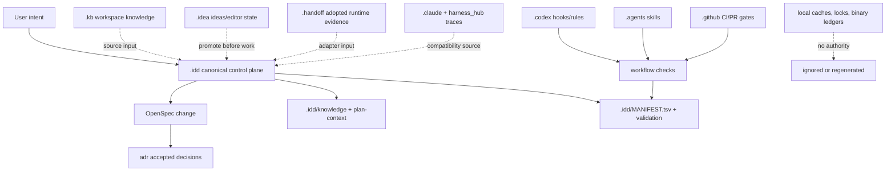
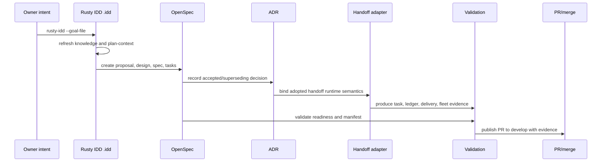
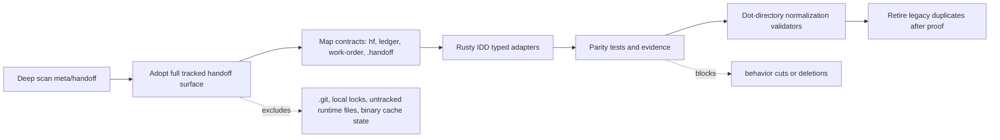
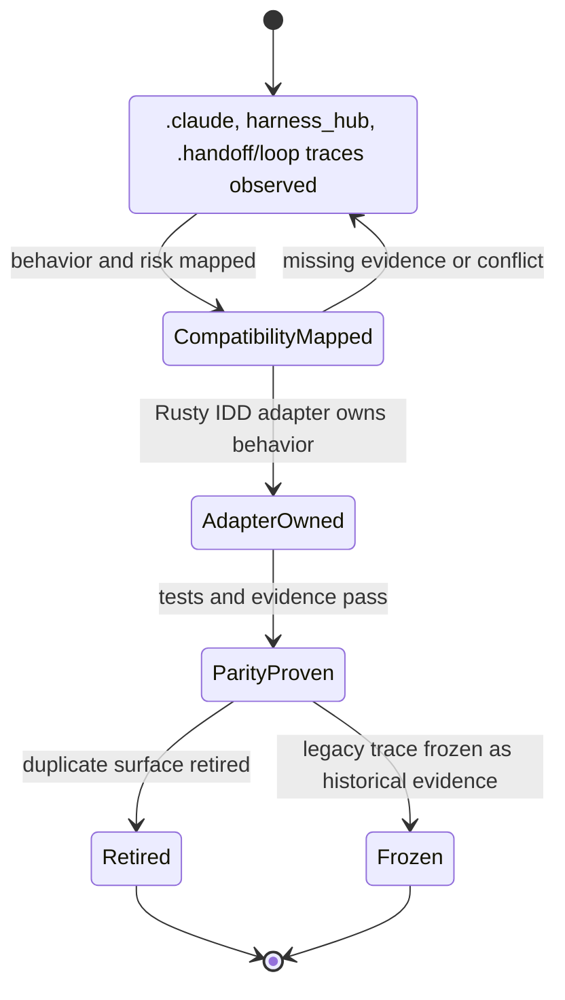
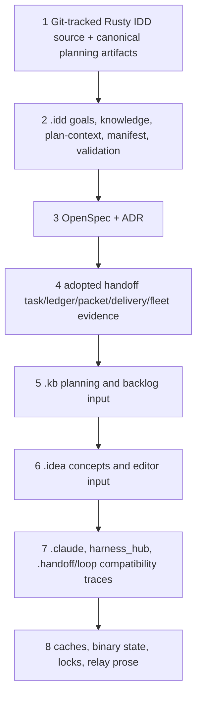
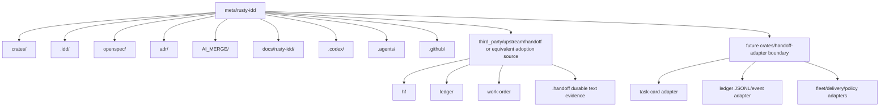
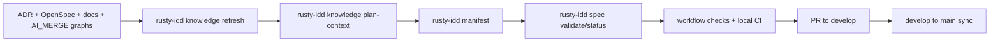

# Architecture Graphs

These graphs are planning evidence for Rusty IDD consuming `meta/handoff` whole
while governing the growing dot-directory surface.

## Dot-Directory Ownership

## Intent To Evidence Lifecycle

## Handoff Adoption And Migration

## Compatibility And Retirement

## State Precedence

## Target Repository Layout

## Validation Flow

