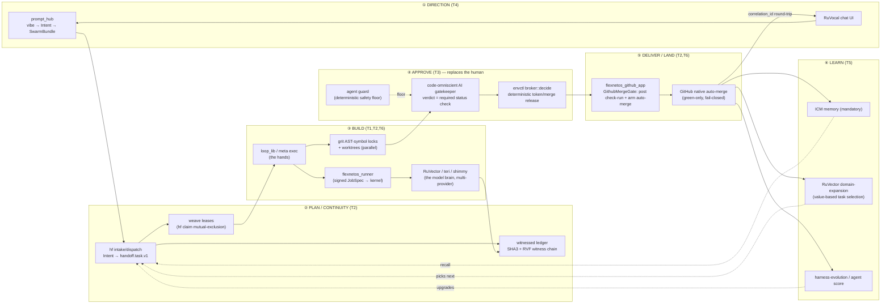

# ADR-0001 — the FlexNetOS autopilot keystone

**Status:** accepted (2026-06-13) · **Owner:** FlexNetOS architecture (handoff kernel as system of record) ·
**Type:** keystone / umbrella ADR (the one all others descend from)

**Derived from (two canonical north-stars):** the **handoff kernel doctrine** `NORTH-STAR.md`
(this repo — a local-first, auditable, reversible, model-native agentic OS; CECCA/NOA executive
kernel; the Gold/Sandbox/Candidate/Failed-World promotion model; **Integrity · Reversibility ·
Capability Gain — no promotion without all three**) AND the **fleet vision** `NORTH-STAR.md`
(meta root, v2 2026-06-13 — single-person-conglomerate autopilot; verbatim mission below). The
kernel doctrine governs *how* every change in this repo promotes; the fleet vision sets *where*
the system is going. Also: `NEEDS-HUMAN.md`
(the wall register the T3 plan demolishes), `ARCHITECTURE-TRUTH.md` (the plane map), the
`Continuity_Ledger_Kernel_PRD.md` (the handoff contract), the ten-pillar code census (handoff, prompt_hub,
envctl, RuVector, grit, flexnetos_runner, flexnetos_github_app, loop-engine, agent, weave, adjacent-agentic-repos),
and the nine ADRs already shipped (ADR-0002 .. ADR-0010). All load-bearing claims are grounded in code
state as of 2026-06-13, not aspiration.

**Relationship to the prior ADR-0001.** A loop-mechanics ADR-0001 ("Handoff Loop v2 —
worktree-isolated, cycle-batched, review-gated shipping") already exists at
`.handoff/decisions/ADR-0001-loop-upgrades.md` and is cited by section/line across 19 HFTASK cards and
ADR-0008 (`ADR-0001 §2/§5/§5a/§5b/§6/§7/§9.x/§11/§12/§13`, `R3..R14`, line refs `:329/:536-540/:803-817/:920-923`).
**Those anchors remain valid and authoritative** — that record is hereby re-scoped as **ADR-0001-B
(Loop v2)**, the *build* chapter. **This document is ADR-0001-A (the Keystone)**, the *why/whole-system*
chapter the prior record never wrote: the six-tenet mission, the one end-to-end pipeline, the
NEEDS-HUMAN demolition plan, the multi-provider layer, and the T6 end-state metric. Read A for the
vision and the system; read B for the loop verbs. They do not conflict; A is the frame, B is the
mechanism inside the "build → approve → land" leg.

---

## 1. The NORTH-STAR (verbatim) and the six tenets

### 1.1 The mission, verbatim (`NORTH-STAR.md`)

> **NO HUMAN IN THE LOOP.** A non-technical user makes any request at the front door; the system
> transforms, executes, verifies, and delivers it as intended — witnessed at every step, fail-closed at
> every gate, remembered across every session. Humans handle only genuine walls: physical actions,
> account-level auth, irreversible org-wide destruction, and changes of intent itself.

> prompt_hub (front door) turns intent into `handoff.task.v1` envelopes → hf claims with weave leases,
> works in fresh worktrees, checkpoints into the witnessed fleet ledger → PRs gate on real CI plus a
> code-omniscient AI gatekeeper (a required status check, never a bot-approve) → GitHub-native
> auto-merge lands green work → vox speaks milestones, ICM remembers everything, kb holds the plans,
> n8n shows the map, and the Cognitum Seed hardware-anchors the witness chains. RuVector is the agentic
> OS this rides on; teri+shimmy give it a swarm-prediction engine; lane+obscura give it the network and
> the web; kasetto+envctl give every agent its environment and secrets.

The ten non-negotiable laws of `NORTH-STAR.md` (code-is-truth; adopt-then-extend/no-downgrade;
never-destroy-work; `Git > witnessed ledger > task cards > ADRs > narrative`; worktrees-for-all-changes;
fail-closed-merges/never-bot-approve; genuine-org-forks-only; no-unrequested-org-mutation; plan-in-kb /
execute-in-.handoff; memory-mandatory) are incorporated by reference and bind every decision below.

### 1.2 The six tenets (precise restatement)

The mission decomposes into six load-bearing tenets. These are the **T1..T6** axes against which every
pillar is graded in §2 and the census; they are stated here canonically for the first time.

| Tenet | Name | Precise statement |
|------|------|-------------------|
| **T1** | **Provider-agnostic model layer** | Any model provider (Anthropic, OpenAI, Google, Bedrock, local Ollama/llamafile/shimmy, …) can drive any task. Provider keys are *injected*, never custodied by the agent, never in shell/git/child-env; routing chooses the right model per capability/cost. The mechanism is **envctl key-injection + RuVector/teri routing** (§5). |
| **T2** | **End-to-end autopilot (no human in the loop)** | The full pipeline — direction → plan → build → approve → land → learn — runs unattended, witnessed at every step, fail-closed at every gate, resumable from the repo across sessions. No human re-establishes context; no human clicks merge. |
| **T3** | **Human replaced by capability, not by a rubber stamp** | Every approval/human wall is replaced by a *model with the human's skillset* (a code-omniscient gatekeeper, a deterministic broker, a capability-grown solver) — never a bot-approve, never a blind vote. Only **genuine owner walls** survive (§3). This tenet is the heart of the ADR. |
| **T4** | **Direction-only input (vibe → built deliverable)** | The owner supplies *intent* in natural language; the system synthesizes verifiable specs (`handoff.task.v1` with real `path_scope`/`acceptance_criteria`/`test_commands`) and builds + ships the deliverable. Front door = prompt_hub + RuVocal. |
| **T5** | **Co-learning / self-upgrade** | The system improves its own agents, skills, prompts, routing, and memory from the witnessed outcomes of prior cycles. Substrate = ICM (memory, mandatory) + RuVector (SONA/GNN/domain-expansion meta-learning) + `agent score` + harness-evolution. |
| **T6** | **Single-person conglomerate** | One human directs **N businesses / N repos** unattended from a single continuity plane. The structural prerequisite is fleet-scale fan-out with isolation (two-ledger fleet model, worktrees, grit cross-repo locks, an org-wide trusted writer); the end-state metric is §5/§6. |

---

## 2. System architecture — one end-to-end autopilot pipeline

The pillars are not a toolbox; they compose into a **single directed pipeline** with one continuity
plane underneath. Each leg below names the pillar(s) that own it, the contract crossed, and the present
readiness (from the code census). The unifying invariant is the state-precedence law:
**Git > witnessed ledger > task cards > ADRs > narrative** — every leg writes a witnessed ledger event
so the whole pipeline is replayable and tamper-evident.

### 2.1 The pipeline (data flow)

### 2.2 Leg-by-leg contract and readiness

| Leg | Owns it | Contract crossed | Readiness (census 2026-06-13) |
|-----|---------|------------------|-------------------------------|
| **① Direction (T4)** | prompt_hub (vibe engine, SwarmBundle), RuVocal | NL intent → `Intent` → `SwarmBundle` | **partial.** Vibe pipeline runs end-to-end but intent classification is *keyword heuristics* and `SwarmBundle.role_prompts` is `HashMap::new()` (empty in prod, `swarm.rs:164`). RuVocal is an unmodified HF chat-ui fork; nothing consumes loop events yet. |
| **② Plan / continuity (T2)** | handoff (`hf`), ledger, weave | `Intent → handoff.task.v1`; `hf claim` ↔ weave lease; events → witnessed chain | **load-bearing-working.** `hf` builds and exposes the full verb set; ledger is real (SHA3-256 + prev-hash witness chain, concurrent-writer-safe, 396 verified events). `hf intake/dispatch` exist but vibe→spec *synthesis* is thin and seam-dependent (HFTASK-0003/0019). Leases proven (`lease.rs`, 7 tests). |
| **③ Build (T1/T2/T6)** | loop_lib + meta_cli (hands), grit (parallel locks), flexnetos_runner (execution), RuVector/teri/shimmy (brain) | `meta exec` fan-out; grit `claim→work→done`; signed JobSpec → kernel route; provider call | **mixed.** loop-engine is **load-bearing-working** (64-repo fan-out, snapshots, worktrees). grit is **working** (AST locks, worktrees, serialized merge) but driven only by skill-prose, not a deterministic auto-driver; `grit session start` broken in 0.3.0; cross-repo blocked on envctl Phase 8. flexnetos_runner is **scaffold** — plans/verifies but executes nothing (no `UnixListener`, no `Command::new`). RuVector brain is real but **unwired** to hf and to envctl. |
| **④ Approve (T3)** | gatekeeper (judgment), envctl broker (enforcement), agent guard (floor) | verdict = *required GitHub status check*; `broker::decide` releases token/merge; guard denies destructive ops pre-tool | **the load-bearing gap.** `agent guard` is mature/working (deterministic floor). The gatekeeper *judgment* exists only as a Claude skill (`gatekeeper-review`); `hf review verdict` only *records* an out-of-band verdict (HFTASK-0014 unbuilt). envctl `broker::decide` authorization core is real, but the data-plane that *releases* a credential is `todo!()` (HFTASK-0013, Phase 8). `permission_gate=true` is still a live human wall. |
| **⑤ Deliver / land (T2/T6)** | flexnetos_github_app (trusted writer), GitHub native auto-merge | mint scoped token → post check-run → arm `gh pr merge --auto --squash` | **partial.** App is live (webhook HMAC verify → route → dispatch proven through a tunnel; token mint via `secretctl mint-github` works). But `merge_gate.rs` ships only `UnwiredMergeGate` (fails closed, zero external callers) — **no `GithubMergeGate`, no REST client, no check-run post, no auto-merge arm.** `hf ship` *does* arm GitHub-native auto-merge locally (HFTASK-0029), so the loop can land its own PRs today; the org-wide write-back is the unbuilt half. |
| **⑥ Learn (T5)** | ICM (memory), RuVector domain-expansion, harness-evolution, `agent score` | recall before deciding / store on triggers; value-based next-task; mine run → harness upgrade | **memory works; closed loop does not.** ICM is mandatory and load-bearing. Value-based selection (HFTASK-0018, Thompson/bandit via `ruvector-domain-expansion`) is backlog — selection is topological-only. `agent score` measures effectiveness but nothing consumes the grades. RuVector's self-learning (SONA/GNN/micro-LoRA) is real but internal to RuVector, not yet reaching the harness's skills/agents. |

### 2.3 The continuity plane (under everything)

The handoff kernel is the **system of record** for the whole pipeline: every leg emits a witnessed
ledger event (`session_start`, `cycle_open`, `pr_opened`, `review_verdict`, `permission_verdict`,
`pr_merged`, …, see ADR-0001-B §7). Human-facing views (`active.md`, `packets/latest.md`, the context
capsule, task cards) are **rendered from ledger replay, never hand-written**; drift between a rendered
view and ledger/git truth is detectable (`hf drift`) and reconcilable. The fleet residency is two-ledger
(ADR-0004 §3): **FLEET** = `meta/.handoff/ledger.db`, **KERNEL** = `meta/handoff/.handoff/ledger.db`,
and every other repo's `.handoff` is **git-text-only** (no per-repo `ledger.db`). This is what makes
T6 (one human, N repos) structurally possible.

---

## 3. The NEEDS-HUMAN demolition plan (T3, made concrete)

T3 is the heart of the ADR: **every human/approval wall is replaced by a model carrying the human's
skillset, except genuine owner walls.** `NEEDS-HUMAN.md` is the live register the loop currently
escalates to; it starves (7 items, two verification passes, **0/7 actioned**) precisely because most of
its entries are *decisions a capable agent can take*, not walls. ADR-0005 created the witnessed steward
to absorb the decisions; this section enumerates the **four wall-classes**, the model-with-the-skillset
that replaces each, the deterministic enforcement under it, and exactly what must be built to get there.

The replacement pattern is always two-layered (ADR-0001-B §5b): **judgment** (a capable model) +
**deterministic enforcement** (a pure, default-deny, fail-closed gate) — so compromising the judgment
model still cannot bypass the gate. Judgment is fallible; enforcement is not.

| Wall-class | Concrete examples (from `NEEDS-HUMAN.md`) | Replaced by (model + the human skillset it carries) | Deterministic enforcement under it | What must be built to get there | Status |
|------------|-------------------------------------------|------------------------------------------------------|-------------------------------------|----------------------------------|--------|
| **W1 — Review / merge approval** (the largest class) | "who approves this PR / the merge-gate Environment" | **Code-omniscient AI gatekeeper** — a reviewer with full call-graph knowledge (gitkb `kb_callers`/`kb_impact` and/or RuVector) that judges a change against its *whole blast radius*, not the diff. Carries the senior reviewer's skillset. | (a) **gatekeeper verdict = a required GitHub status check** (a CI job posting a check-run), never a bot-`APPROVE` (gh-aw #25439). (b) **`agent guard`** as the deterministic destructive-command/scope floor beneath it. (c) branch protection: green required checks + native auto-merge. | **HFTASK-0014** (build the gatekeeper, not skill-only) + **flexnetos_github_app `GithubMergeGate`** (post check-run + arm auto-merge — currently `UnwiredMergeGate`, no REST client). Then flip `permission_gate=false`. | **NOT BUILT.** Judgment is a Claude skill; `hf review verdict` only records; write-back unwired. *Highest-leverage T3 task.* |
| **W2 — Credential / account-level egress** (account/credential class) | reaching `api.github.com` / a model provider with a real key; minting installation tokens; rotating secrets | **envctl as the credential autopilot** — the daemon decides credential grants the way a human secret-handler would, using USB-presence + peercred + Cognitum-Seed possession factors + policy. The agent never holds a real key. | **`envctl broker::decide`** — pure, sync, **default-deny**, fail-closed presence gate, host/path/method allowlists, ≤24h peer-bound relay bearers, budgets/quotas. The *only* thing that releases a credential or permits `POST …/merges`. | **HFTASK-0013** + envctl **Phase 8 data-plane**: `inject.rs::injection_template()`, `Engine::run_child()`, `secretd/src/proxy.rs` egress, a webpki-pinned `Upstream` (only `NullUpstream` today), `secretctl run` (currently bails "Phase 8"). | **NOT BUILT (control plane real, data plane stubbed).** Vault + broker authorization + `mint-github` work; no agent can yet *receive* a swapped credential. Blocks grit shared backend + runner P3 too. |
| **W3 — Scope-expanding / mass-mutation** (scope class) | a 52-repo sweep across third-party forks; anything that would *grow* the granted scope | **The witnessed steward (ADR-0005) under the scope law** — a model with the owner's *judgment about scope boundaries*: it can sequence freely *within* a granted scope and decide reversible repo-scoped changes, but a verdict can **never expand** scope. | **The permission classifier** (ground-truth boundary: it denied the 52-repo sweep, approved the 21 FlexNetOS-owned narrowing). One denial → narrow once and retry; second denial → escalate verbatim. Plus the protected-files denylist (`.github/`, `.handoff/policy.toml`, ADRs, manifests). | Steward agent + scope-law rubric (**shipped**, ADR-0005). Optional: **`cognitum-gate`** (HFTASK-0017) as the in-loop witnessed action governor (`Permit/Deny/Defer`) composing with the credential gate. | **PARTIALLY BUILT.** Steward + scope law + classifier-as-ground-truth are in force. Witnessed action-governor (cognitum-gate) is backlog. |
| **W4 — Irreversible / physical / intent-change** (irreversible + physical + "change of intent" classes) | repo *deletion*; visibility flips; org-secret grants; Cognitum-Seed USB replug; renames; **any change to NORTH-STAR.md itself** | **Genuinely retained as human walls** — by design. T3 replaces *approval-of-reversible-work*, not the owner's authorship of intent or irreversible/physical acts. The model's skillset does **not** include "decide the owner's intent" or "take a physical action." | **`never-destroy-work` law** + agent guard blocking `rm -rf` on repo roots/`.meta`, force-push, `reset --hard`; **snapshot-before-mutation** (`meta git snapshot`); NORTH-STAR changes "only by owner intent, never silently." | Nothing — these *stay* walls. The work here is making sure they are the **only** walls (i.e. that W1–W3 are demolished so the queue contains *only* W4). | **BY DESIGN.** These are the residual ~handful of `NEEDS-HUMAN.md` "genuine walls"; the success metric (§5) is that the queue contains nothing else. |

**The demolition sequence** (build-order law, NORTH-STAR.md): the W2 credential data-plane (envctl
Phase 8) unblocks W1's enforcement *and* grit/runner; W1's gatekeeper + `GithubMergeGate` then close
the loop's last human click; W3's steward is already live. End-state: only W4 remains.

---

## 4. The multi-provider model layer (T1)

T1 is delivered by **two seams that must meet**: envctl injects the key, RuVector/teri routes the model.

### 4.1 envctl key-injection (the credential half)

Provider keys live only in envctl's encrypted libSQL vault behind a peercred-gated UDS control plane.
The intended end-state (`env-ctl run -- <agent>`) overlays per-provider env into the *child process
only* — `ANTHROPIC_API_KEY` / `OPENAI_API_KEY` / base-URL / proxy / CA — so a key never touches shell
history, git, or the child's persistent env, and is swapped for the real value only at egress. The
architecture is already **provider-pluralistic**: a `Provider` enum (Anthropic/OpenAI/GitHub/Generic)
with frozen per-provider canonical upstream allowlists and a per-provider `DataPlaneMode`
(`BaseUrlRepoint` / `HttpsProxyMitm` / `NativeSubtoken`). **The gap is the data plane**:
`inject.rs::injection_template()` (the literal per-provider env mapping) and `Engine::run_child()` are
`todo!()`; `secretctl run` bails "Phase 8." Until that lands, **no provider's key is actually
injectable** — the seam is designed, not wired (this is the same W2 stub as §3).

### 4.2 RuVector / teri routing (the model half)

RuVector's `rvAgent` supplies the first-class `Provider` abstraction
(`Anthropic/OpenAI/Google/Bedrock/Fireworks/Other`) with a `ChatModel` trait and per-provider
`ApiKeySource`; concrete reqwest backends exist for Anthropic and Gemini, plus teri's adapter swarm over
OpenAI/Anthropic/Gemini/Ollama/shimmy and shimmy's local OpenAI-compatible server. **Two gaps:**
(1) **no envctl integration anywhere in rvAgent** (it reads raw `ANTHROPIC_API_KEY`-style env vars), so
the "envctl auto-injects keys for any model" clause is unmet at this seam; and
(2) **no capability/cost-aware model router** — the crate named `ruvector-router-core` is a *vector*
HNSW index (a naming trap), and `composite.rs` routes file-ops by path prefix, not models by
capability/cost.

### 4.3 The T1 wiring decision

The provider-agnostic layer is realized by closing exactly two seams, in order:

1. **envctl Phase 8 data-plane** (`injection_template` + `run_child` + proxy + pinned `Upstream`) — the
   credential half (W2, HFTASK-0013). *This is the single highest-leverage move for T1 and unblocks T3/W2.*
2. **envctl ↔ rvAgent integration + a real capability/cost model router** — rvAgent reads its
   `ApiKeySource` *via* an envctl-injected child env, and a new router selects provider-per-task by
   capability/cost (not the vector index). hf records *which provider executed each task* in the ledger
   so multi-provider attribution/routing is witnessed.

Until both close, T1 is a schema and a set of working-but-unrouted backends — provider-pluralistic by
design, not yet provider-agnostic in operation.

---

## 5. Success criteria — the T6 end-state metric (single-person conglomerate)

T6 is reached when **one human directs N independent businesses/repos, unattended, from a single
continuity plane.** That is measurable. The end-state is declared met when **all** hold:

1. **Zero-touch cycle.** A vibe request entered at the front door produces a merged, delivered change —
   direction → built → approved → landed → result round-tripped to the originator — with **zero human
   interactions** except W4 walls. (Metric: `pr_merged` events whose witness chain contains no
   `permission_verdict:human` link.)
2. **NEEDS-HUMAN contains only W4.** The escalation queue holds *only* genuine owner walls (physical,
   account/credential-root, irreversible, intent-change). No reversible/scope-bounded/approval item ever
   appears. (Metric: every queue item classifies as W4 under §3.)
3. **`permission_gate = false`** in `policy.toml` across the fleet, because the §3-W1 gatekeeper +
   §3-W2 broker are trusted in production (the documented trigger to lift the transitional human gate).
4. **Fleet fan-out at N.** `hf fleet status` aggregates the FLEET ledger across N repos; concurrent
   agents work N codebases at once with **0% work-loss** (grit cross-repo shared backend live), and the
   org-wide trusted writer (`GithubMergeGate`) lands changes across all N. (Metric: ≥2 distinct ventures
   advancing unattended in the same window with no merge-conflict-induced loss.)
5. **Co-learning is closed (T5).** Loop outcomes measurably improve the harness: value-based task
   selection beats topological order on completion rate, and `agent score` / harness-evolution feed
   changes back into skills/agents without a human authoring each. (Metric: a cycle-over-cycle
   improvement curve sourced from ledger outcomes.)

The bar (NORTH-STAR.md): *finished product, not a plan* — each criterion is a built, witnessed,
test-backed capability, not a claim.

---

## 6. Status, consequences, and relationship to the existing ADRs + PRD

### 6.1 Status

**Accepted as the keystone framing.** It records no new code contract of its own; it *frames and orders*
the contracts the descendant ADRs and HFTASK backlog already define. The descendant ADRs are
unchanged and remain the implementation authorities.

### 6.2 How the existing ADRs descend from this keystone

| ADR | Pipeline leg / tenet it serves | Role under the keystone |
|-----|--------------------------------|-------------------------|
| **ADR-0001-B** (`.handoff/decisions/ADR-0001-loop-upgrades.md`) | ②③④⑤ — the loop itself (T2) | The *build/approve/land* mechanism: session lifecycle, cycle-batched ship, review-gate, GitHub-native auto-merge, the §5b gatekeeper design, envctl-broker enforcement (§9.5/R10). The body of legs ② → ⑤. |
| **ADR-0002** (weave A2A conventions) | ② continuity / coordination (T2/T3) | The five A2A surfaces (leases, jobs, messaging, approvals-as-verdicts) behind `hf claim` and the relay heartbeat. |
| **ADR-0003** (kb ↔ handoff seam) | ① plan / ⑥ learn (T4/T5) | One-way ledger → `.kb` mirror: plan in kb, execute in `.handoff`. |
| **ADR-0004** (fleet handoff rollout) | continuity plane / T6 | The two-ledger residency (FLEET vs KERNEL; per-repo git-text-only) — the structural prerequisite for §5.4. |
| **ADR-0005** (NEEDS-HUMAN steward) | ④ approve (T3) | Demolishes wall-class **W3** (scope) under the scope law; the witnessed-verdict role replacing human decisions. |
| **ADR-0006** (meta portability) | continuity plane (T2/T6) | Makes the kernel portable across the fleet (fixes the hardcoded-northstar packet-renderer bug) so §5.4 fan-out is real. |
| **ADR-0007** (retire flexnetos_secrets) | ④/T1/W2 | Consolidates secrets to envctl as the single source of truth — the W2 credential authopilot's home. |
| **ADR-0008** (github_app + runner two-plane) | ③ build + ⑤ land (T2/T3/T6) | The execution plane (runner) and the trusted-writer control plane (app); home of `GithubMergeGate` (W1 enforcement) and the runner's envctl bearer seam (W2). |
| **ADR-0009** (grit parallel coordination) | ③ build (T2/T6) | AST-symbol locks + worktrees — demolishes the *merge-conflict* sub-class of human intervention; the fleet-scale parallel substrate. |
| **ADR-0010** (grit shared backend via envctl) | ③ build / T6 | Cross-repo grit locks — blocked on the same W2 Phase-8 data plane; the conglomerate-scale coordination primitive. |

**Relationship to the PRD** (`Continuity_Ledger_Kernel_PRD.md`): the PRD is the *implementation contract*
for one pillar (the handoff continuity kernel — leg ② and the continuity plane). Its scope is
deliberately narrow ("owns one thing: durable, conflict-safe, drift-resistant project state that any
agent can resume from") and it explicitly *disclaims* model-provider management. This keystone is the
*super-set* the PRD sits inside: the PRD builds the plane; the keystone explains how that plane carries
the other five legs to the T6 end-state. The PRD's per-task `intent_lock.northstar_revision: "ADR-0001"`
field now resolves to **this** document as the vision anchor (and to ADR-0001-B for loop mechanics).

### 6.3 Consequences

**Positive**
- The six tenets (T1–T6) are stated canonically for the first time; the census and every future ADR can
  cite a single, authoritative definition instead of an implicit framework.
- The whole system is legible as **one pipeline** with named owners, contracts, and honest readiness —
  not a pile of repos. The two load-bearing gaps are unmistakable and ordered.
- The T3 demolition plan turns "replace the human" from a slogan into a four-class table with a build
  sequence and a fail-closed enforcement layer under each replacement.

**Negative / risks**
- **Two stubs gate most of the north-star.** Legs ④ (approve) and ⑤ (land) and tenet T1 all converge on
  (a) **envctl Phase 8 data-plane** (W2) and (b) **flexnetos_github_app `GithubMergeGate`** + **HFTASK-0014
  gatekeeper** (W1). Until these land, the system is an excellent *witnessed continuity + ship rail* whose
  autonomous-approval and provider-agnostic promises are designed, not running.
- **The brain is co-resident, not integrated.** RuVector (T5/T1) and the native runtime (harness-agent-rs,
  a 7-line scaffold) are not yet called by the kernel loop; co-learning is memory-only (ICM) today.
- **No deterministic auto-driver.** The loop advances when a Claude skill/agent drives `hf`/`grit`; there
  is no in-binary daemon, so a stalled orchestrator stalls the kernel. T2's "unattended" still leans on
  the orchestrating agent staying alive.

**Demolition order (the keystone's standing directive):** envctl Phase 8 (W2) → `GithubMergeGate` +
HFTASK-0014 gatekeeper (W1) → flip `permission_gate=false` → grit shared backend + runner P1/P2 (T6
fan-out) → envctl↔rvAgent + capability router (T1) → close the co-learning loop (T5). When that
sequence completes and §5's five criteria hold, the queue contains only W4 and the single-person
conglomerate is operational.
