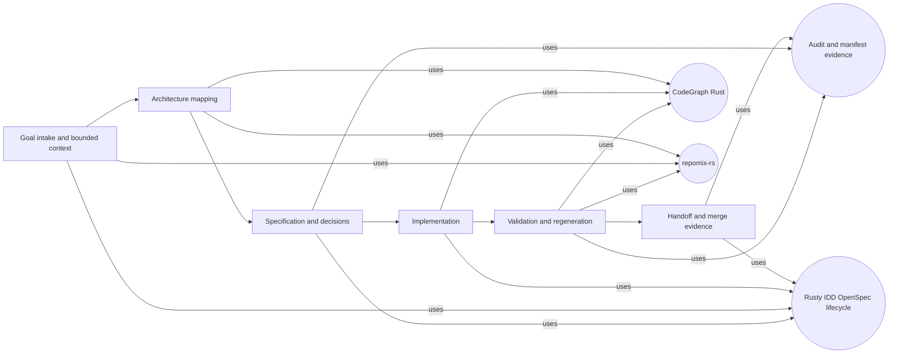
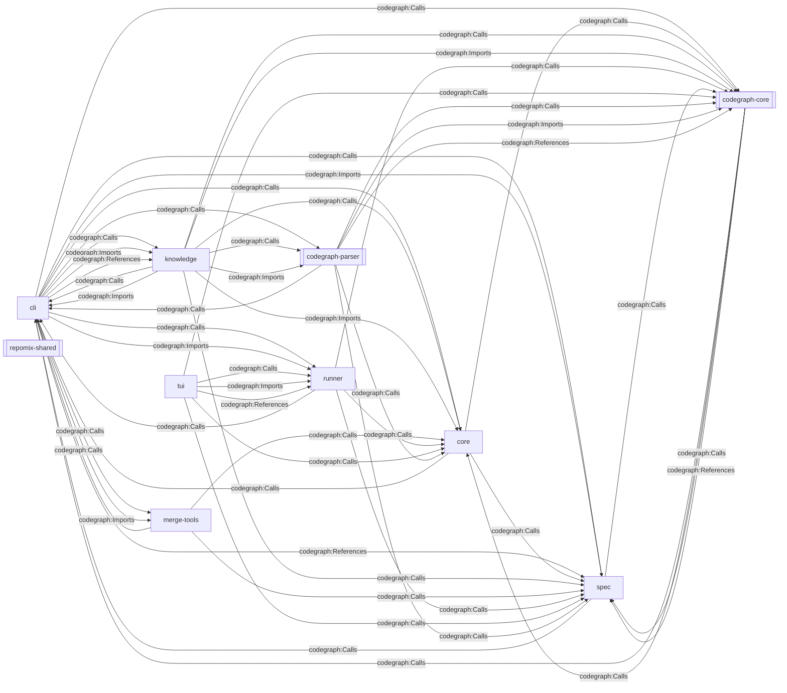
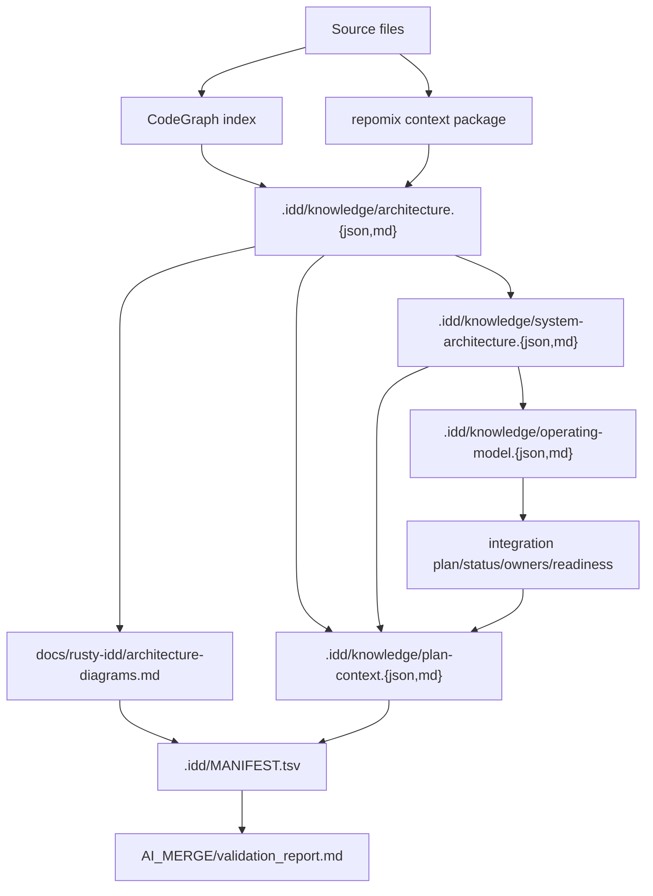

# rusty-idd Architecture Diagrams

> Generated by `rusty-idd knowledge diagrams`. Do not hand-edit; regenerate with `just diagrams`.

- Source graph: 149 files, 9210 nodes, 37690 edges via `codegraph-rust`
- Context package: 399 files, 768804 tokens via `repomix-rs`
- Components: 10; integration surfaces: 4; automation stages: 6

## Autonomous Workflow

## Crate And Integration Boundaries

## Generated Artifact Flow

## Diagram Inputs

| Input | Provider | Count |
|---|---|---:|
| Source files | `codegraph-rust` | 149 |
| Graph nodes | `codegraph-rust` | 9210 |
| Graph edges | `codegraph-rust` | 37690 |
| Packed files | `repomix-rs` | 399 |
| Packed tokens | `repomix-rs` | 768804 |

## Findings

- CodeGraph-backed parsing completed without source failures
- repomix context package measured 399 files and 768804 tokens
