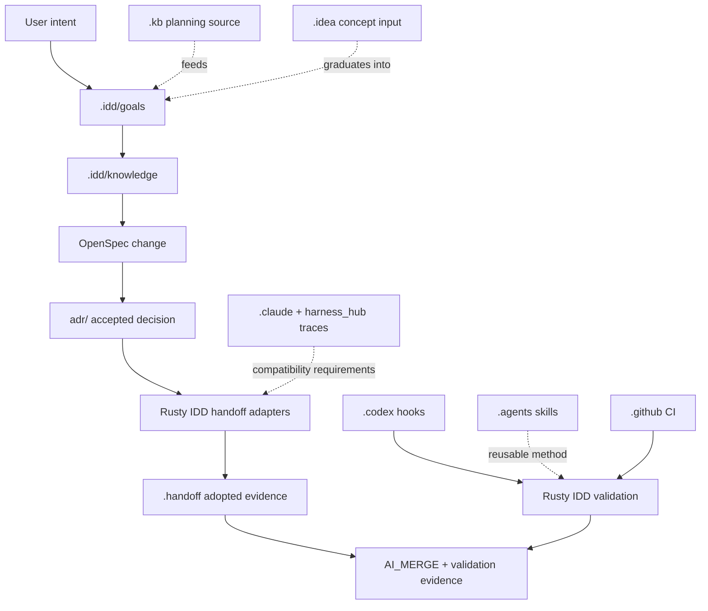

# Dot-Directory Architecture

Rusty IDD is the canonical control plane. Handoff is consumed whole as an
adopted runtime and evidence capability. Dot directories are not peers; each
directory has a specific authority class.

## Authority Model

| Surface | Works As | May Authoritatively Decide | May Not Decide |
|---|---|---|---|
| `.idd/` | Rusty IDD control plane | goal binding, generated context, manifest, validation evidence | task lease history, editor preferences |
| OpenSpec + `adr/` | planning and decision record | requirements, migration design, accepted decisions, supersession | runtime witness history |
| `.handoff/` | adopted runtime evidence | task cards, claims, checkpoints, delivery packets, fleet views, ledger compatibility | current intent if `.idd` or OpenSpec disagree |
| `.kb/` | workspace knowledge/backlog input | task discovery and source notes | implementation readiness |
| `.idea/` | idea/editor workspace | early concepts and IDE project metadata | workflow truth |
| `.claude/` | legacy harness source material | compatibility evidence | Rusty IDD current behavior |
| `meta/harness_hub` traces | historical harness lineage | adoption requirements and compatibility risks | canonical combined architecture |
| `.codex/` | Codex enforcement | hook policy, workflow checks, local agent execution policy | product requirements |
| `.agents/` | reusable agent skills | reusable workflow instructions | current change approval |
| `.github/` | remote delivery gate | CI, PR policy, branch protection | local planning truth |
| cache/editor dot dirs | local tool state | nothing durable | anything workflow-related |

## State Precedence

1. Git-tracked Rusty IDD source and canonical planning artifacts.
2. `.idd` goal, knowledge, plan-context, manifest, and validation output.
3. OpenSpec proposal, design, spec deltas, task readiness, and ADRs.
4. Adopted `.handoff` evidence through typed Rusty IDD adapters.
5. `.kb` workspace knowledge and backlog source documents.
6. `.idea` concepts and editor state.
7. `.claude`, `meta/harness_hub`, and `.handoff/loop` compatibility traces.
8. Binary caches, local locks, editor caches, untracked runtime files, and
   historical relay prose.

## How The Directories Work Together

## Handoff Consumption Rule

Rusty IDD consumes `meta/handoff` whole. That means the migration starts by
preserving the complete tracked handoff surface as an upstream/reference source,
then mapping behavior into Rusty IDD-owned adapters. The migration does not
begin by cherry-picking `hf` commands, flattening `.handoff`, or rewriting the
ledger from memory.

The durable handoff semantics to preserve are:

- task-card schema and task minting;
- claim, checkpoint, done, and delivery flow;
- fleet status and packet rendering;
- policy and drift gates;
- ledger event export/import and JSONL compatibility;
- `.handoff` text evidence that can be rebuilt or validated from typed events.

Binary `ledger.db`, local lock files, and untracked runtime outputs are caches
or local coordination files. They are not promoted into canonical Rusty IDD
state unless a future ADR changes that boundary.

## Migration Phases

| Phase | Purpose | Output |
|---|---|---|
| 0 | Planning and visual architecture | this ADR, OpenSpec package, graph evidence, generated Rusty IDD artifacts |
| 1 | Adopt-first mirror/reference | full tracked `meta/handoff` surface preserved for scan, graph, and rollback |
| 2 | Typed adapters | Rusty IDD-owned handoff task, ledger, delivery, fleet, and policy boundaries |
| 3 | Parity gates | tests proving adapter behavior matches handoff behavior |
| 4 | Dot-directory normalization | validators and manifest rules proving ownership and retention |
| 5 | Compatibility retirement | old harness traces frozen or retired only after parity evidence exists |

## First Implementation Slice

The next implementation change should adopt the complete tracked `meta/handoff`
surface as a Rusty IDD upstream/reference snapshot, excluding `.git`, untracked
runtime caches, local lock files, and binary state. It should add an inventory
and adapter-boundary map, but it should not refactor or delete handoff behavior
yet.

That keeps the migration evidence-based: Rusty IDD can inspect, graph, test,
and reference the whole handoff system before cutting duplicate or stale pieces.
