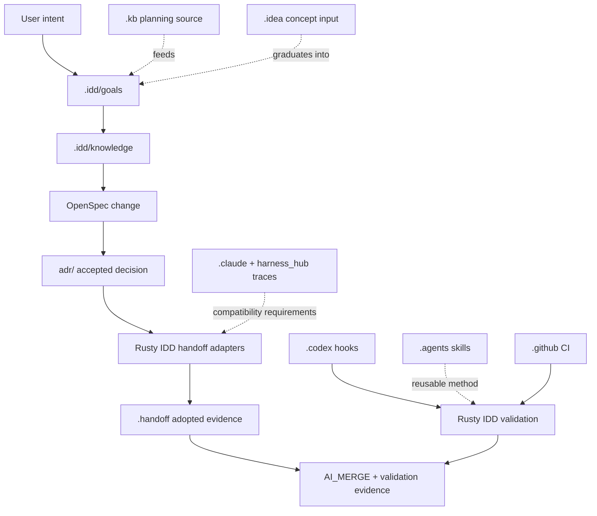

# Dot-Directory Architecture

Rusty IDD is the canonical control plane. Handoff is consumed whole as an
adopted runtime and evidence capability. Dot directories are not peers; each
directory has a specific authority class.

## Authority Model

| Surface | Works As | May Authoritatively Decide | May Not Decide |
|---|---|---|---|
| `.idd/` | Rusty IDD control plane | goal binding, generated context, manifest, validation evidence | task lease history, editor preferences |
| OpenSpec + `adr/` | planning and decision record | requirements, migration design, accepted decisions, supersession | runtime witness history |
| `.handoff/` | adopted runtime evidence | task cards, claims, checkpoints, delivery packets, fleet views, ledger compatibility | current intent if `.idd` or OpenSpec disagree |
| `.kb/` | workspace knowledge/backlog input | task discovery and source notes | implementation readiness |
| `.idea/` | idea/editor workspace | early concepts and IDE project metadata | workflow truth |
| `.claude/` | legacy harness source material | compatibility evidence | Rusty IDD current behavior |
| `meta/harness_hub` traces | historical harness lineage | adoption requirements and compatibility risks | canonical combined architecture |
| `.codex/` | Codex enforcement | hook policy, workflow checks, local agent execution policy | product requirements |
| `.agents/` | reusable agent skills | reusable workflow instructions | current change approval |
| `.github/` | remote delivery gate | CI, PR policy, branch protection | local planning truth |
| cache/editor dot dirs | local tool state | nothing durable | anything workflow-related |

## State Precedence

1. Git-tracked Rusty IDD source and canonical planning artifacts.
2. `.idd` goal, knowledge, plan-context, manifest, and validation output.
3. OpenSpec proposal, design, spec deltas, task readiness, and ADRs.
4. Adopted `.handoff` evidence through typed Rusty IDD adapters.
5. `.kb` workspace knowledge and backlog source documents.
6. `.idea` concepts and editor state.
7. `.claude`, `meta/harness_hub`, and `.handoff/loop` compatibility traces.
8. Binary caches, local locks, editor caches, untracked runtime files, and
   historical relay prose.

## How The Directories Work Together



## Handoff Consumption Rule

Rusty IDD consumes `meta/handoff` whole. That means the migration starts by
preserving the complete tracked handoff surface as an upstream/reference source,
then mapping behavior into Rusty IDD-owned adapters. The migration does not
begin by cherry-picking `hf` commands, flattening `.handoff`, or rewriting the
ledger from memory.

The durable handoff semantics to preserve are:

- task-card schema and task minting;
- claim, checkpoint, done, and delivery flow;
- fleet status and packet rendering;
- policy and drift gates;
- ledger event export/import and JSONL compatibility;
- `.handoff` text evidence that can be rebuilt or validated from typed events.

Binary `ledger.db`, local lock files, and untracked runtime outputs are caches
or local coordination files. They are not promoted into canonical Rusty IDD
state unless a future ADR changes that boundary.

## Migration Phases

| Phase | Purpose | Output |
|---|---|---|
| 0 | Planning and visual architecture | this ADR, OpenSpec package, graph evidence, generated Rusty IDD artifacts |
| 1 | Adopt-first mirror/reference | full tracked `meta/handoff` surface preserved for scan, graph, and rollback |
| 2 | Typed adapters | Rusty IDD-owned handoff task, ledger, delivery, fleet, and policy boundaries |
| 3 | Parity gates | tests proving adapter behavior matches handoff behavior |
| 4 | Dot-directory normalization | validators and manifest rules proving ownership and retention |
| 5 | Compatibility retirement | old harness traces frozen or retired only after parity evidence exists |

## First Implementation Slice

The next implementation change should adopt the complete tracked `meta/handoff`
surface as a Rusty IDD upstream/reference snapshot, excluding `.git`, untracked
runtime caches, local lock files, and binary state. It should add an inventory
and adapter-boundary map, but it should not refactor or delete handoff behavior
yet.

That keeps the migration evidence-based: Rusty IDD can inspect, graph, test,
and reference the whole handoff system before cutting duplicate or stale pieces.

---

## Fleet Unification Addendum — `.kb` + `.meta` + `.handoff` + `.idd` → `.idd` (2026-07-07)

Operator-approved landing of the four-system unification plan (Fable 5 session
e212f5cc, runtime-proven research; full report in the session terminal record;
fact→command journal in the session scratchpad `FINDINGS.md`). This section is
append-only: everything above is unchanged (pre-edit copy archived, sha256
`b455457e2ac5002a9354c631e0864adcb4d88f7914d68f1ad8e7ef05007b6684`). It extends
the authority model above from this repo to the FlexNetOS fleet.

### Ground truths the plan stands on (all verified live 2026-07-07)

1. GitKB (`git-kb` 0.2.12 = latest release; closed-source binary, open
   protocol; org `github.com/gitkb`) stores canonically as TEXT
   (`store/documents/**.md`, `commits/*.json`, `refs/`, `manifest.json`); the
   SQLite `.cache/gitkb.db` is derived and rebuilds. `export`/`backup`/`bundle`
   proven — no data lock-in.
2. The `.kb` directory NAME is hardcoded: `GITKB_ROOT` must point at the
   directory *containing* `.kb/`; a renamed store is refused. A symlink
   `.kb → .idd/kb` works (committed doc served through it).
3. handoff's residency doctrine is already text-canonical (ADR-0004 §3,
   ADR-0018 D1): committed truth = `.handoff/ledger.events.jsonl` + rendered
   text; the redb `ledger.db` (magic bytes `redb`; ADR-0017) and RVF sidecars
   are gitignored rebuild caches (`hf import`). Live violation found:
   `teri/.handoff/ledger.db.rvf` is git-tracked.
4. `meta` is gitkb-org lineage (FlexNetOS/meta forks `gitkb/meta`; installed
   0.2.22): manifests (`.meta.yaml`) are text; `.meta/plugins` binaries stay
   untracked and tool-owned; `~/.meta` is user-scope state.
5. Tooling gaps gating migration: `hf` and `rusty-idd` binaries are not
   installed on the box; the fleet `.handoff` rollup home is unseeded under
   `~/FlexNetOS/src`; `.idd/knowledge/index.json` here still carries the old
   `workspace_root` (`/home/drdave/...`) and needs regeneration.

### Target: one canonical center, many faces

```
<repo>/.idd/
├── kb/            # GitKB store relocated whole (.cache/ ignored)
├── handoff/       # capsule, cards, packets, ledger.events.jsonl committed;
│                  # ledger.db / *.rvf gitignored rebuild caches
├── goals/ knowledge/ evidence/ MANIFEST.tsv LOCK.md workflow/ staged/
│                  # rusty-idd control plane (already .idd-native)
├── proofs/        # planning-spine ProofRecords land here, merged to the
│                  # spine proof_ledger.jsonl
└── meta/          # REFERENCES ONLY into envctl truth / .meta.yaml locations
<repo>/.kb      -> .idd/kb        (required compatibility symlink — name is hardcoded)
<repo>/.handoff -> .idd/handoff   (transition symlink until hf learns .idd paths)
fleet root (src/, beside release-workspace.meta.yaml): .idd/handoff = FLEET ledger home
```

Boundary contracts: envctl keeps config authority (`.idd/meta` holds pointers,
never copies); the planning-spine task-graph sheet remains the human surface and
`.idd` is the local agent/reality store; GitKB stays vendor code (symlink +
`GITKB_ROOT` + MCP — never forked); the ADR-0003 kb↔handoff one-way seam
survives relocation unchanged; weave routes events and never replaces the task
graph or proof ledger.

### Storage rule (recommended, operator-decided)

Text-canonical journal in git with binaries derived and ignored — i.e. enforce
the estate's existing accepted doctrine (ADR-0018 D1 / ADR-0004 §3; GitKB's own
store; `.idd` is already all-text) uniformly. Alternatives considered and
scored down: meta-owned out-of-git binary store (breaks repo self-containment,
new invariant to police) and content-addressed sidecar (unbuilt machinery).

### Migration — strangler sequence (each phase one bounded packet, with proofs + rollback)

| Phase | Work | Completion proof (ProofRecord-shaped) | Rollback |
|---|---|---|---|
| 0 | Install `hf` + `rusty-idd`; `.idd` skeleton + `.idd/meta` pointers in pilot repo (envctl); tracked-binary lint | `--version` outputs; skeleton census; lint flags teri RVF | delete skeleton |
| 1 | Pilot then per-repo: `git mv` `.kb`→`.idd/kb`, `.handoff`→`.idd/handoff`; compatibility symlinks | doc/event/card counts + sha256 parity vs 2026-07-07 baselines (envctl 18 docs / 85 events / 55 cards; prompt_hub 1/48/71; weave –/25/3; …); `git-kb verify` + round-trip reads; `hf import` rebuild parity | `git mv` back |
| 2 | Fleet-wide symlinks; rusty-idd typed handoff adapters; agent/MCP surfaces repointed; fleet rollup home seeded; spine packets/proofs wired to `.idd/proofs` | every capability re-demonstrated through `.idd` paths only; `hf sync` provenance verifies end-to-end | re-invert symlinks |
| 3 | Archive after parity soak: `archive/pre-idd-<repo>-<date>` tags; untrack teri RVF (file kept); stale caches archived — nothing deleted | archive tags listed; zero legacy-path readers (hook/skill/CI grep); tracked-binary lint clean | tags restore any pre-state |

Acceptance tests (before any archive step): kb CRUD through symlink; card
mint→claim→checkpoint→done with JSONL append + redb rebuild parity; `hf resume`
cold-start from `.idd/handoff`; `git-kb mcp` against relocated KB; `meta exec`
unchanged; spine packet→proof round-trip through `.idd/proofs`; zero tracked
binary DBs anywhere.

Recorded deltas to honor (runtime over docs): `git-kb config set` does not
exist (author identity requires a `[user]` section in `.kb/config.toml`; the
documented `[identity]` author form does not commit); the LifeOS spec References
table mis-describes rusty-idd ("identity and capability discovery") versus this
repo's actual role; the envctl/ADR-0006 home-symlink invariant is not yet
realized on this box.

### Execution substrate landed — capability tested (2026-07-07, IDD-UNIFY-001)

The 4-phase migration above now has its execution substrate BUILT and the core
capability PROVEN by a one-command E2E (`nu_plugin/examples/idd_unify_e2e.nu`):

- **envctl `migration`** (worktree branch `idd-unify/migration-db`, commits
  `2981b2c` + `3aee261`): event-sourced migration DB on pure-Rust redb (no-c gate
  PASS) — 15 package-DDL entities, hash-chained event ledger, R3+ approval gate,
  replay verification. Agent review REPLACES human review on the same queue:
  deny-by-default, decisions + rationale + evidence as ledger events.
- **codedb capture/materialize** (nu_plugin commits `13a4992` + `09f2005`):
  exact-byte sha256 blob store + byte-for-byte re-emission; gaps enumerated.
  `nu_plugin_codedb` registered in nu 0.113.1.
- **Proven on real snapshots** (kb 419 files / meta 2 / handoff 340 / idd 83):
  byte parity IDENTICAL 4/4; git-kb served 133/133 docs through `.kb -> .idd/kb`;
  hf rendered 56 tasks via `.handoff -> .idd/handoff`; rusty-idd `validate`
  reports identical findings on the unified tree as on pristine source; verb
  matrix 0 unmapped; replay 11/11; two fresh runs reproduced the identical tree
  lock `3f92a5dfa9291853e904b302bea60ef89362f62452c65304daacdce118ff0a2f`.
- **New runtime deltas**: CodeDB TASK_GRAPH.csv statuses stale vs code; codedb
  doctor recommends nu 0.112.2 but the plugin protocol is 0.113.1; installed
  git-kb misresolves the KB root from a worktree cwd (the repo-rule warning is
  live); envctl `catalog` scan test flakes under parallel `cargo test` only.
- ProofRecord: `lifeos/planning-spine-v0/proof_records/IDD-UNIFY-001.proof.json`
  (ledger entry 23; `bun run planning-spine:verify` green).
