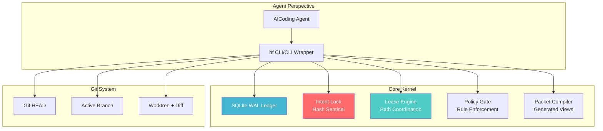
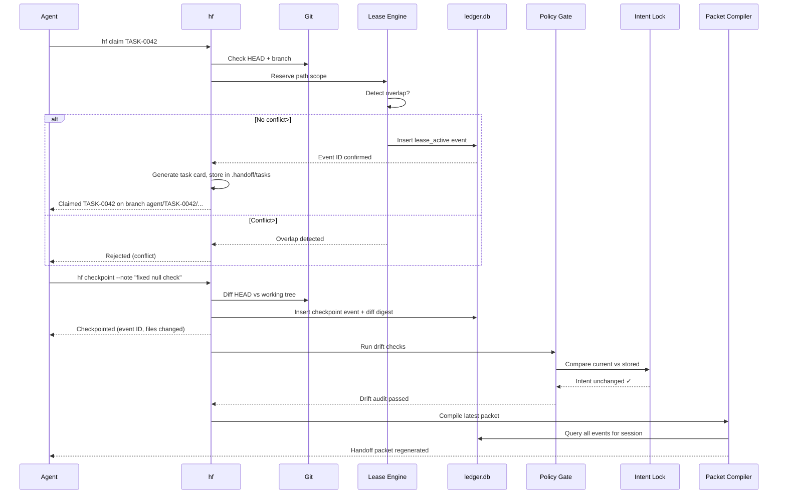

# Continuity Ledger Kernel Architecture

## Overview
The Continuity Ledger Kernel is a Rust-native, repo-local handoff system for AI coding agents. It provides durable session state that any agent can resume from without human help.

## Core Principles

| Principle | Explanation |
|-----------|-------------|
| Repo is memory | No chat history; all state in Git + ledger.db |
| Git is physical | HEAD + working tree diff is the source of truth |
| Ledger is operational | Events (claims, leases, checkpoints) are the trail |
| Packet is compiled | Handoff packets are generated from ledger, not authoritative |

## Architecture Diagram



## State Precedence

When conflicts arise, use this order:

1. **Git HEAD + Worktree Diff** (physical state)
2. **ledger.db Events** (operational trail)
3. **Task Cards** (.handoff/tasks/*.task.json)
4. **Decision Records** (.handoff/decisions/*.adr.md)
5. **Active State** (.handoff/active.md)
6. **Handoff Packet** (.handoff/packets/latest.md)

## Intent Lock System

Every task receives an immutable intent lock:

```json
{
  "objective_hash": "blake3:...",
  "path_scope_hash": "blake3:...",
  "acceptance_hash": "blake3:...",
  "constraint_hash": "blake3:...",
  "northstar_revision": "blake3:adr-0001"
}
```

**Drift Detection:** Any change to these fields changes the hash. The system blocks handoff if intent drifts from recorded state.

## Event Ledger

SQLite WAL database with append-only events:

```sql
CREATE TABLE events (
    id INTEGER PRIMARY KEY AUTOINCREMENT,
    event_type TEXT NOT NULL,
    timestamp_ns INTEGER NOT NULL,
    action_hash BLOB NOT NULL,  -- blake3 of payload
    agent_id TEXT,
    task_id TEXT,
    metadata JSONB
);
```

**Tamper Evidence:** Each event's `action_hash` creates a chain. Any modification breaks the chain.

## Lease System

Transaction-based path coordination:

```rust
BEGIN IMMEDIATE;
  SELECT * FROM leases WHERE overlap(path_scope);
  IF no_overlap THEN
    INSERT INTO leases (agent_id, task_id, path_scope, expiry_ns);
  ELSE
    ROLLBACK; -- conflict detected
  END IF;
COMMIT;
```

**Safety Rules:**
- No write without claim
- No overlapping writes
- Atomic lease transactions

## Policy Gates

Enforced at key transitions:

| Gate | Checks |
|------|--------|
| PreEdit | Inside path scope, intent unchanged |
| PostCommand | Evidence recorded, exit code valid |
| PreTest | Test matrix resolved |
| PostTest | Results captured, failures flagged |
| PreHandoff | Checkpoint + tests + drift audit |

## Handoff Packet

Generated view from ledger state:

```
1. Project North Star
2. State Precedence Reminder  
3. Active Objective
4. Current Task
5. Branch/Worktree Info
6. Files Changed
7. Commands Run
8. Tests Run
9. Drift Audit
10. Next Best Task
11. Resume Commands
```

## Data Flow



## Key Components

| Component | Purpose | Source of Truth |
|-----------|---------|-----------------|
| hf CLI | Entry point, command routing | Code + schemas |
| ledger.db | Event store | SQLite WAL |
| Intent Locks | Drift sentinel | Hash comparison |
| Lease Engine | Path coordination | SQLite transactions |
| Policy Gate | Rule enforcement | TOML config |
| Packet Compiler | View generation | Ledger queries |

## Failure Modes

| Scenario | Response |
|----------|----------|
| Crash during claim | Previous state preserved, recovery task created |
| Corrupted event | Chain breaks, reconciliation required |
| Overlapping lease | Rejected at transaction boundary |
| Intent drift | Hard fail before handoff |
| Stale lease | Recoverable (extend or reset) |

## Scalability Characteristics

- **Read:** O(1) for latest state, O(n) for full replay
- **Write:** O(1) per event, atomic transactions
- **Conflict detection:** O(n²) per write (n = active leases)
- **Packet generation:** O(n) over events for current session

## Security Model

| Threat | Mitigation |
|--------|------------|
| State corruption | WAL + action_hash chain verification |
| Concurrent writes | Lease-based path coordination |
| Intent drift | Hash comparison before handoff |
| Unauthorized access | Policy gates on destructive commands |
| Persistence loss | Git as ultimate source of truth |

## Testing Strategy

- Unit tests: 148 total across modules
- Drift tests: All 10 drift modes detected
- Crash tests: Recovery preserves valid state
- Replay tests: Ledger reconstructs state correctly
