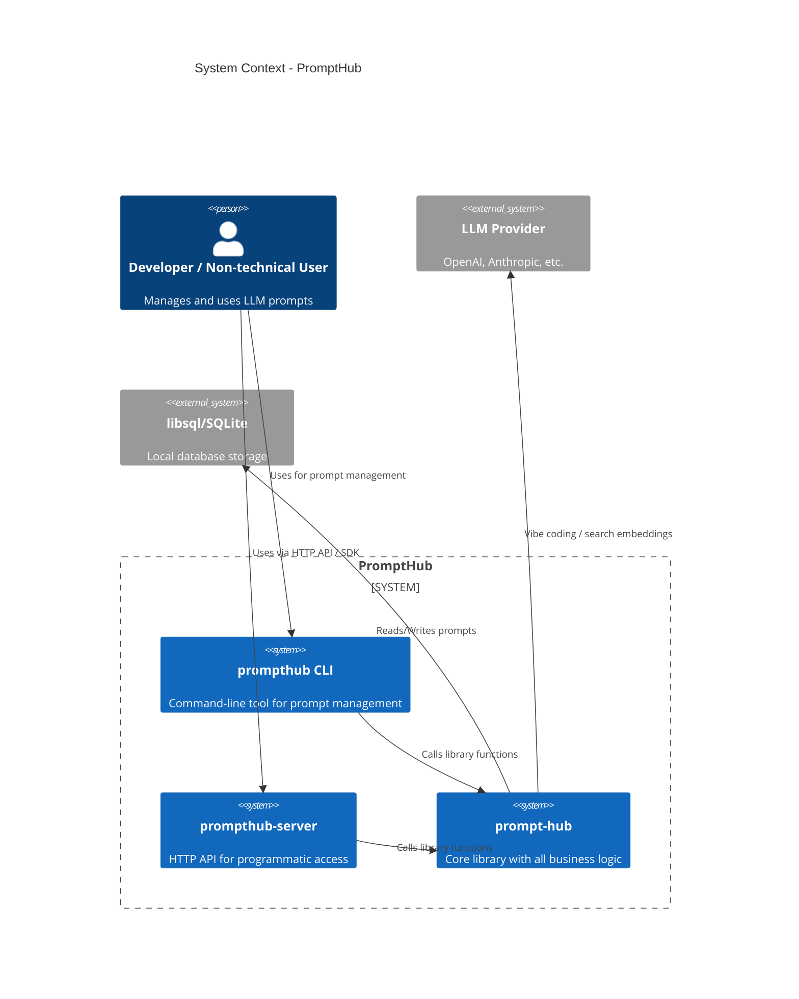
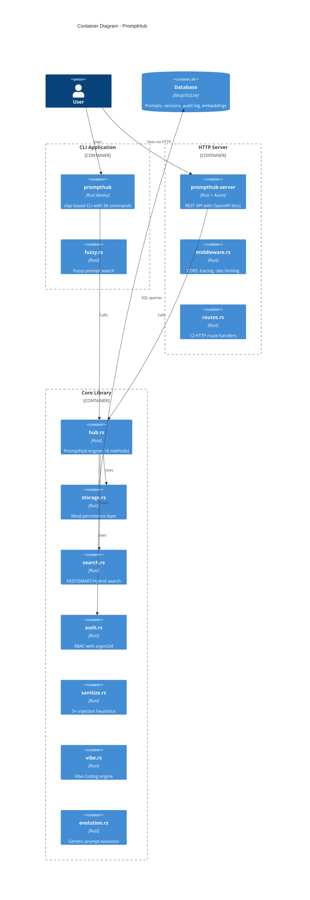

# Architecture

## C4 Model

### System Context Diagram (C4 Level 1)



### Container Diagram (C4 Level 2)



## Data Flow

```
[User] → [CLI/HTTP] → [PromptHub::new()] → [Sanitizer] → [Storage]
                                              ↓
                                         [Audit Log]
                                              ↓
                                         [Search Index]
                                              ↓
                                         [Sync Events]
```
