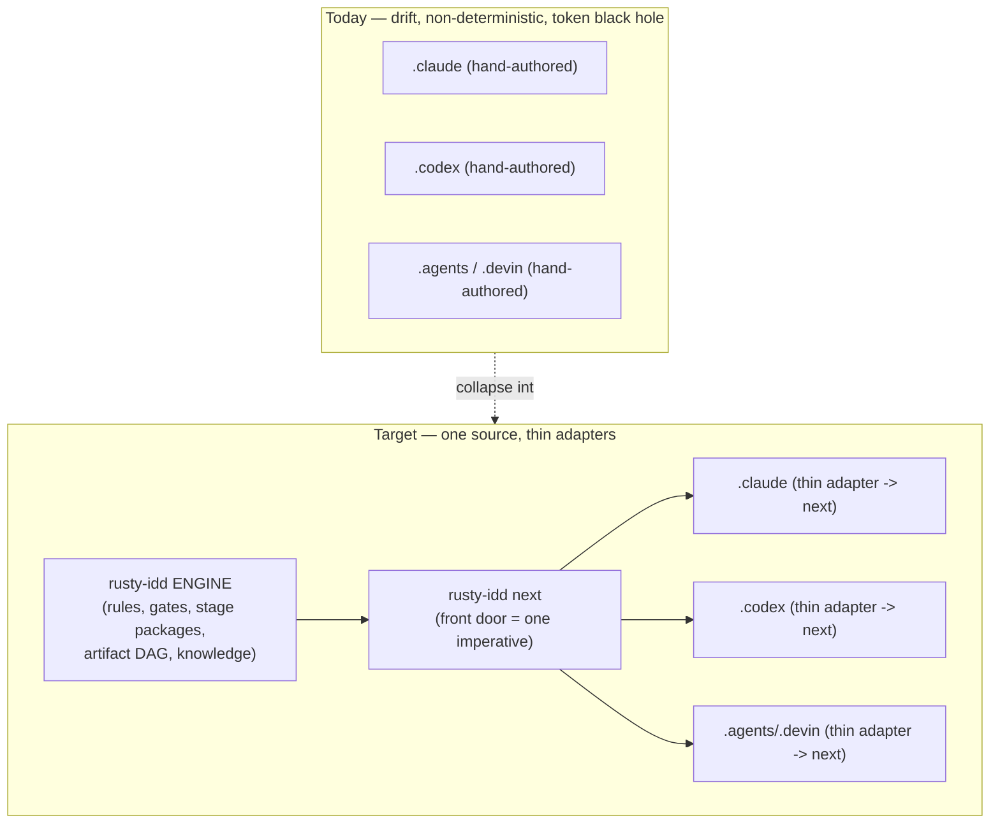
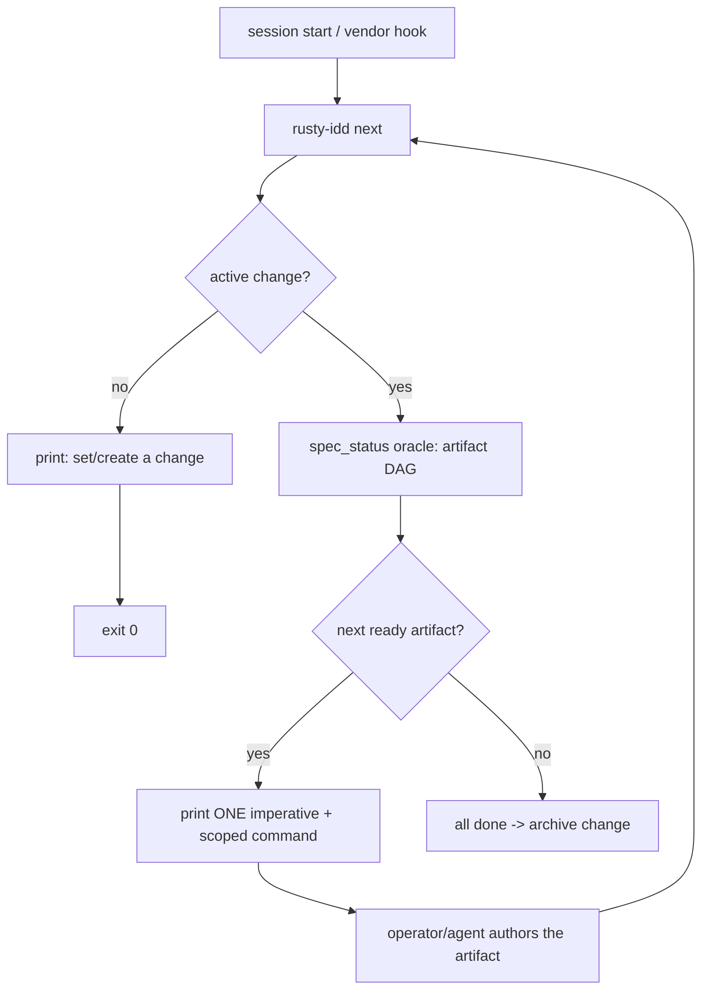
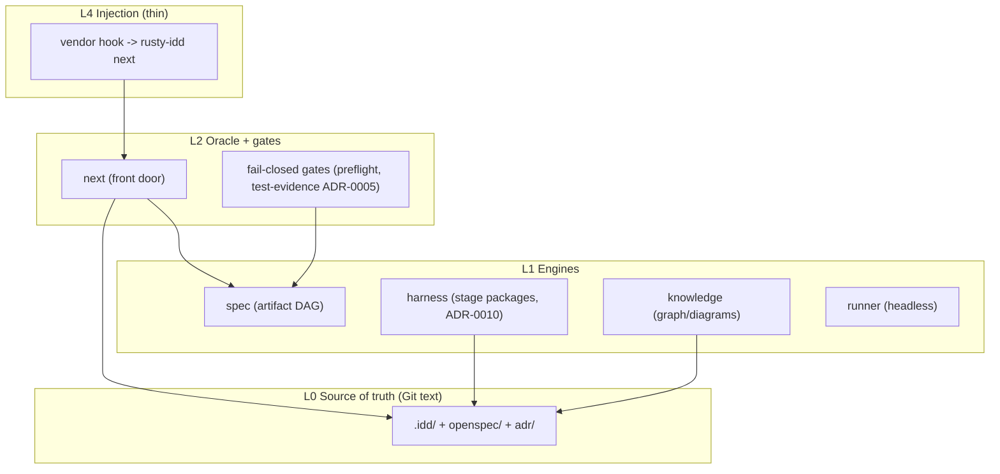

# harness-control-plane — Design

## Context

Across every AI runtime (Claude Code, Codex, Gemini, Devin), agents re-derive
"how to work in this repo" from prose spread across `CLAUDE.md`, `AGENTS.md`,
`.claude/`, `.codex/`, `.agents/`, `.devin/`, and a dozen rule files. That has
three structural failure modes, model-agnostic:

1. **Discovery** — the rules live in many files; an agent rarely finds them all.
2. **Synthesis** — the *order* of the workflow is inferred from prose, lossily.
3. **Choice** — prose "you should…" competes with the model's drive to finish,
   and loses.

It is also a **token black hole**: the prose corpus is re-injected every session
and re-read by every model, spending context on selection instead of the current
step.

This is **already decided architecture**, not a greenfield idea:

- **ADR-0001** — the harness *follows* Rusty IDD flow; `AI_MERGE/` is evidence,
  not the control plane.
- **ADR-0002** — vendor surfaces are a *thin portable front door* over canonical
  sources.
- **ADR-0010** — *"Rusty IDD owns task-scoped agent harness packages… `.codex`,
  `.claude`, `.kimi`, `.agents` are adapters or compatibility views. They must
  invoke Rusty IDD package generation instead of growing into broad
  always-loaded toolboxes."* First slice: `rusty-idd harness package --stage scan`.

The engine already ships the hard parts: the artifact-DAG **oracle**
(`rusty-idd spec status` / `spec next`), **graph + diagram generation**
(`rusty-idd knowledge architecture` / `diagrams` / `operating-model`), and the
first **stage package** (`harness package`). The missing piece is the
**deterministic front door** that ties active goal → current state → next
imperative into one command the thin vendor adapters can call.

## Goals / Non-Goals

**Goals:**
- One front-door command, `rusty-idd next`, that computes the single next
  imperative for the active change and is the only thing vendor adapters call.
- Reuse the existing spec-engine oracle — exactly one next-step computation.
- Bound per-session context cost (token economy): emit one step, not the corpus.
- Document the unified control-plane architecture as ADR-0015, extending
  ADR-0001 / ADR-0002 / ADR-0010 rather than replacing them.

**Non-Goals:**
- A native Rust swarm *runtime* (vendor runtimes still execute interactive
  subagents). Hybrid: Rusty IDD owns definitions, determinism, gates, and
  headless execution; vendors stay thin execution endpoints.
- Rendering/regenerating the vendor directories in this slice (tracked as a
  follow-up: `render` + `render --check` drift gate).
- New workflow-stage packages beyond the existing `scan` (tracked follow-up).

## Decisions

1. **`rusty-idd next` is the front door (ADR-0015).** It resolves the active
   change from `.idd/workflow/active-change`, prints the artifact-DAG status, the
   single next ready artifact, and one scoped command to produce it.
2. **One oracle.** `next` delegates to `commands::spec_status` (the
   `rusty_idd_spec::schema` DAG). `rusty-idd next` and `rusty-idd spec next`
   cannot disagree.
3. **State precedence is Git-tracked text.** The active pointer is a one-line
   committed file; no hidden binary state.
4. **Vendor adapters stay minimal (ADR-0010).** Their hooks call `rusty-idd
   next`; they do not carry workflow logic. Enforcing this by rendering +
   drift-checking the adapters is the next slice.

### As-is architecture (generated, dogfooded)

Generated by `rusty-idd knowledge diagrams` (141 files, 8832 nodes, 36415 edges).
Full set in [`assets/as-is-architecture-diagrams.md`](./assets/as-is-architecture-diagrams.md).
The autonomous workflow the engine already models:

### To-be: the inversion (source of truth → projection)

### To-be: the determinism loop (front-door state machine)

### Control-plane layers (container view)

## Risks / Trade-offs

- **Vendor adapters not yet enforced thin.** This slice ships the front door, not
  the render/drift gate. Until then, vendor dirs can still drift; mitigated by
  documenting the adapter contract and tracking the render slice next.
- **`next` is read-only / advisory.** It does not yet *block* skipping a step;
  fail-closed enforcement remains in the push/CI gates (preflight, ADR-0005).
  Advisory-then-enforced is intentional sequencing.
- **Active-change pointer is single-change.** Multi-change concurrency is out of
  scope; the pointer models one focus at a time (matches the loop model).

## Migration Plan

- Additive: `rusty-idd next` is a new subcommand; nothing is removed. The
  existing `spec status`/`spec next` keep working unchanged.
- Rollback: revert the `next` command + this change; the engine is unaffected.

## Open Questions

- Should `render`/`render --check` (vendor-adapter projection + drift gate) be
  the immediately-next change, or should stage-package expansion
  (implementation / validation / handoff swarms per ADR-0010) come first?
- Should `rusty-idd next` gain a `--json` mode for non-interactive adapters?
- ADR numbering: an existing duplicate `0002` (autonomous-hooks vs
  portable-template) should be reconciled when ADR-0015 lands.
