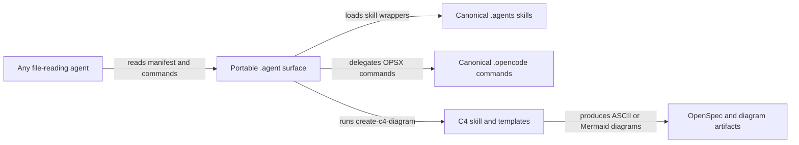

# portable-template-agent-surface - Design

## Context

The template currently has two useful but tool-specific surfaces:

- `intent-driven-template/.agents/skills/**` contains reusable skill bodies.
- `intent-driven-template/.opencode/commands/**` contains slash-command
  instructions for the OpenCode command system.

The goal asks for `intent-driven-template/.agent` to load to any agent and for
commands, including C4 diagram creation, to be actually usable. The safest path
is an adapter layer: add `.agent` as the portable front door while keeping the
existing `.agents` and `.opencode` files as canonical sources.

## Goals / Non-Goals

**Goals:**

- Provide a generic `.agent` entrypoint that file-reading agents can inspect.
- Preserve existing OpenCode command behavior without moving or rewriting the
  command source of truth.
- Make C4 diagram creation directly discoverable as a portable command.
- Validate the new surface with focused tests.

**Non-Goals:**

- Replacing OpenCode, OpenSpec, or the existing `.agents` skill layout.
- Installing global agent tooling or host services.
- Generating C4 diagrams for this repo as part of the template change.

## Decisions

1. Add `intent-driven-template/.agent/manifest.json` as the portable index for
   commands and skills.
2. Add lightweight `.agent/skills/*/SKILL.md` wrappers that point to canonical
   skill files under `.agents/skills`.
3. Add `.agent/commands/opsx-*.md` wrappers that point to canonical OpenCode
   command docs under `.opencode/commands`.
4. Add `.agent/commands/create-c4-diagram.md` as a first-class portable command
   because no equivalent OpenCode command exists today.
5. Extend scanner classification so `.agent`, `.agents`, and `.opencode`
   command/skill files are visible as agent-control inventory evidence.

## C4 Context

The diagram is intentionally a lightweight C4-style system context: the
portable `.agent` surface is the boundary that makes the existing command and
skill material usable by agents that do not have OpenCode-specific conventions.

## Risks / Trade-offs

- Wrappers can drift from canonical files. The manifest and focused tests reduce
  this by checking that important wrapper targets exist.
- A generic `.agent` convention is less formal than OpenCode's command system.
  The design keeps the portable layer declarative and file-based so any agent
  can consume it.

## Migration Plan

Add `.agent` alongside existing files. Existing OpenCode users keep using
`.opencode`; existing skill consumers keep using `.agents`; generic agents use
`.agent` as the front door. Rollback is deleting `intent-driven-template/.agent`
and reverting the scanner/test changes.

## Open Questions

None for this slice. Future work can add generated synchronization checks if
the portable command wrapper set grows substantially.
